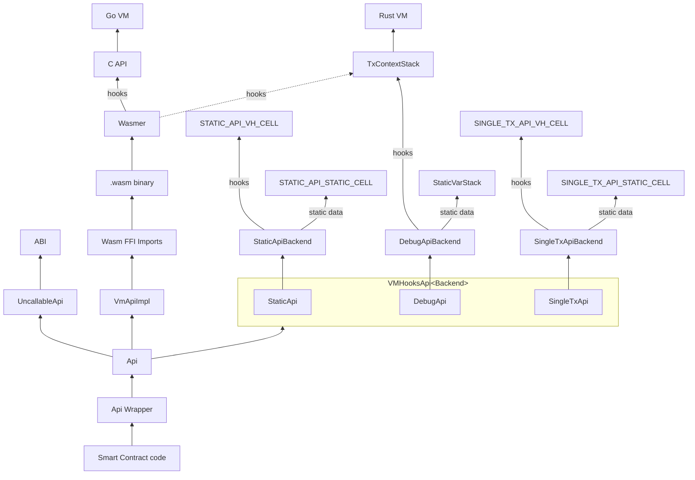

[comment]: # (mx-abstract)

There is quite a long way from smart contract code to VM hook calls.

[comment]: # (mx-context-auto)

## Components overview

```mermaid
graph BT
    sc[Smart Contract code]
    sc --> wrapper[Api Wrapper]
    wrapper --> api[Api]
    api --> UncallableApi --> ABI
    api --> VmApiImpl --> wasm-imports[Wasm FFI Imports]
    wasm-imports --> wasm[.wasm binary] --> Wasmer
    api --> VMHooksApi
    Wasmer --> |hooks| capi[C API] --> go-vm[Go VM]
    Wasmer -.->|hooks| TxContextStack
    subgraph VMHooksApi["VMHooksApi&lt;Backend&gt;"]
        StaticApi
        DebugApi
        SingleTxApi
    end
    DebugApi --> DebugApiBackend
    DebugApiBackend ---->|hooks| TxContextStack
    DebugApiBackend -->|static data| StaticVarStack
    StaticApi --> StaticApiBackend
    StaticApiBackend --->|hooks| STATIC_API_VH_CELL
    StaticApiBackend -->|static data| STATIC_API_STATIC_CELL
    SingleTxApi --> SingleTxApiBackend
    SingleTxApiBackend --->|hooks| SINGLE_TX_API_VH_CELL
    SingleTxApiBackend -->|static data| SINGLE_TX_API_STATIC_CELL
    TxContextStack --> context[Rust VM]
```