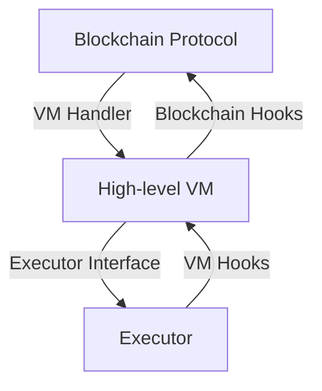
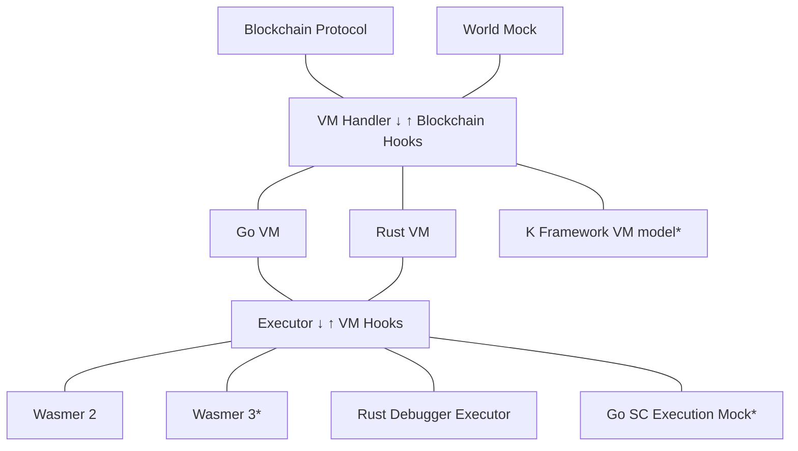
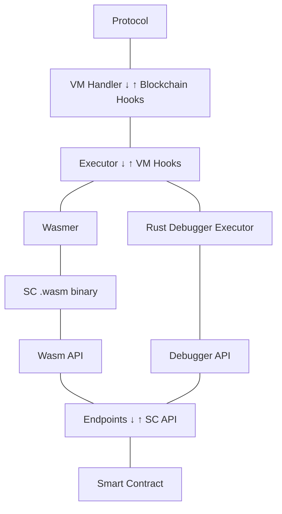
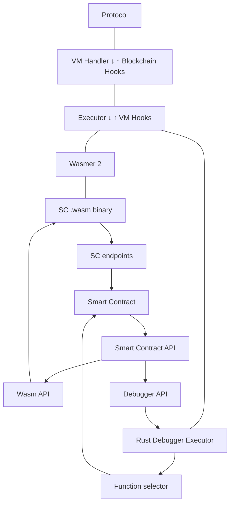
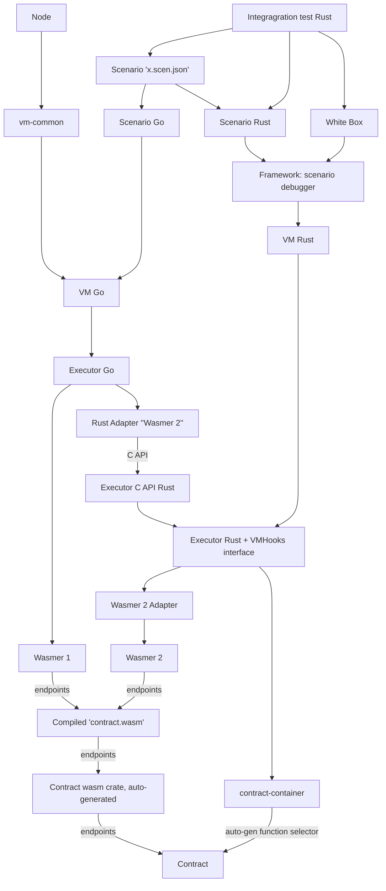

[comment]: # (mx-abstract)

This section aims to provide an overview of the main production and testing components involving smart contracts.

[comment]: # (mx-context-auto)

## Components overview

To understand the architecture of the VM and of the entire contract development and testing infrastructure, a good place to start are the grand components of the system.

Whenever a transaction is processed that contains a smart contract call, the protocol needs call the VM to execute that call and to find the results. There are multiple versions of the VM, and in principle it is possible to also have other VMs with different architectures. For this reason, it is important that the protocol does not have access to the inner workings of the VM.

The only contact point is a pair of interfaces, one for calling the VM, and the other enabling the VM to interrogate the protocol from time to time:
- The one moving _forwards_ is the "VM Handler", with only relevant method `RunSmartContractCall`; 
- The one pointing _backwards_ is known as the "Blockchain Hooks", it contains many methods, for instance for retrieving storage, or for interrogating balances.

Moving further down, we will see that the VM itself is split in two:
1. A higher-level component, the high-level VM;
2. The so-called executor.

This separation emphasizes the main responsibilities of the VM:
1. On a high level, the VM needs to handle everything related to smart contract execution: transferring of funds, storage handling, execution context management, and even same-shard calls between smart contracts.
2. On the lower level, it needs to execute smart contract code as fast as possible, and nothing else.

Similar to the layer above, here we also have a pair of interfaces that preserve the separation of components.
- The one moving _forwards_ is the **Executor** interface. The Executor spawns **Instances**, which cache the compiled code and execute it.
- The one pointing _backwards_ is known as **VM Hooks**, and contains a little over 250 methods, which are the only contact between the smart contract itself and the outside world. These VM hooks are used for everything, from retrieving arguments and balances, to pushing results and making calls to other contracts. They are also used to interact with managed types and cryptographic functions, more on them later.

[comment]: # (mx-context-auto)

## Component variation

Having this separation makes it easy to combine different components in various ways, when assembling production or test systems.

The diagram below shows the main options currently available:

To simplify, in this diagram the interfaces are represented as blocks instead of arrows, connected to them are the suitable existing components.

This diagram also ignores the added trouble of not having all these components written in the same language. Some are Go and some Rust. More on this later.

We will say a few things about all. On the protocol level we have:
- The actual **protocol** running in production.
- **World Mock** - a simplified representation of the state of the protocol, to be used in integration tests. This allows us to run various scenarios locally without having to spin an entire blockchain. There is both a Go and a Rust implementation.

The VMs are as follows:
- The **Go VM** is the only VM currently in use in production. Using it in tests is the closest to the actual execution on the blockchain.
- The **Rust VM** is currently only used for debugging and is not fully featured. By the time of writing this it can only be used in conjuction with the Rust Debugger Executor, but there are plans to make it work with Wasmer and thus bring the debugging experience closer to the real execution.
- The **K Framework VM** is an executable specification of the VM. It contains the logic for both the high-level VM and the executor. It is not yet fully integrated into the MultiversX stack, but once it gets there it will allow symbolic execution, low-level coverage, fuzzing and many other tools.

There are several available executors:
- **Wasmer 2.2** is the only executor currently available in production. To be more precise, the executor itself is a wrapper around the Wasmer 2.2 execution engine. Wasmer compiles and executes WebAssembly code, in our case the compiled smart contracts. This entire component is written completely in Rust.
- **Wasmer 3** is the future upgrade of the production executor. There is no timeline yet for when it will be integrated.
- The **Rust Debugger Executor** is the mechanism through which it is possible to test smart contracts without first compiling them to WebAssembly. It plugs smart contract Rust code directly to the Executor and VM hooks interfaces. This enables step by step debugging in Rust code directly, as well as Rust high-level code coverage.
- There is also a **Go SC Execution Mock**, used for some integration tests in the VM, where performing the full WebAssembly execution would simply overcomplicate the tests. It is currently not directly tied to the executor interface, but there are plans to better integrate it. 

[comment]: # (mx-context-auto)

## Executing smart contracts

All until here refers exclusively to the VM and its low level execution. But now let's have a look at high level contracts and how they relate to this system.

MultiversX smart contracts are written in Rust, using the `multiversx-sc` framework. Contracts need to be compiled to WebAssembly, so they can be executed by Wasmer, as part of the protocol.

However, there are other ways to execute a smart contract, and for this reason the actual build is abstracted away from the high-level SC code. The SC library itself (which contains the logic) is completely detached from the build system. It can only call a standard API, without knowing about the concrete implementation behind it.

There are several API implementations, but the most important are the WebAssemby API (crate `multiversx-wasm-adapter`) and the debugger API (in crate `multiversx-scenario`). The first is used for generating the necessary code to build the WebAssembly binary, the other one is able to connect to the debugging engine directly, in order to run tests, coverage, and to, well, debug.

[comment]: # (mx-context-auto)

## Developer documentation

