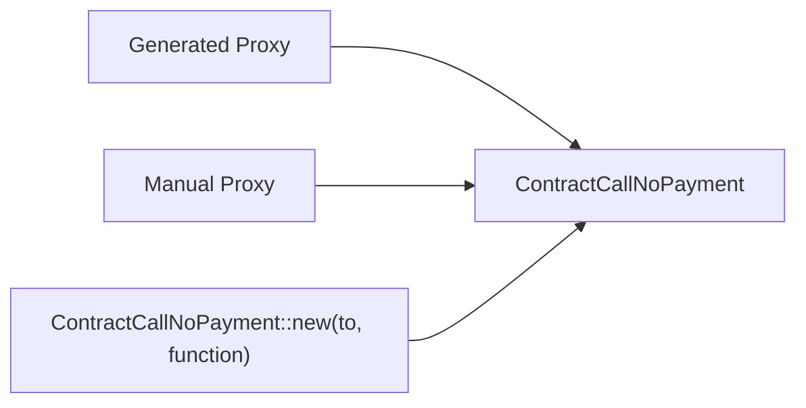
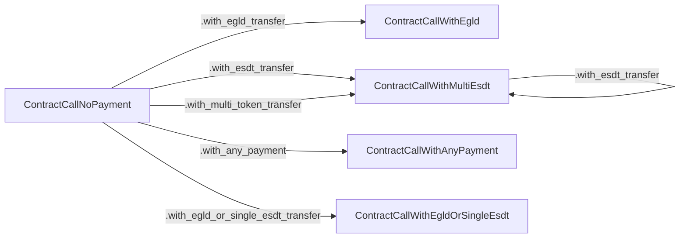
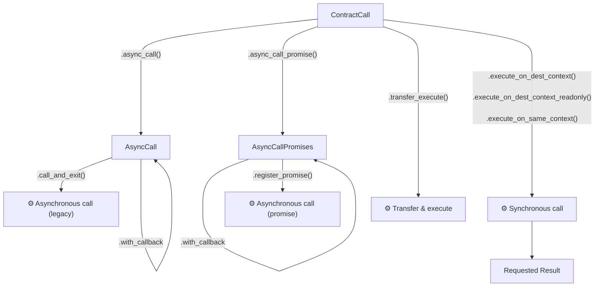
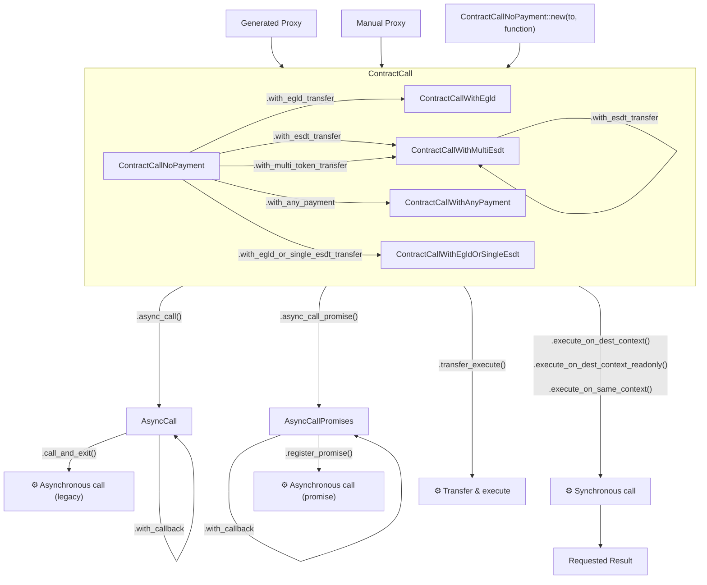

[comment]: # (mx-abstract)

## Introduction

As programmers, we are used to calling functions all the time. Smart contract calls, however, are slightly trickier. Beside code execution, there can also be transfers of EGLD and ESDT tokens involved, gas needs to be specificed, and, finally, there different flavors of calls.

Any system for composing and sending these calls needs to be very versatile, to cater to the programmers' various needs.

It is not so important _where_ that call comes from. Very often we need to call smart contracts from other smart contracts. However, testing systems and blockchain interactors also greatly benefit from such a system.

The system we present below works just as well on- and off-chain. Think of it as a general Rust framework for specifying and sending calls in any context.

---

[comment]: # (mx-context-auto)

## The base call

Smart contract calls are not typed at the blockchain level. It is the contract that keeps track of the number of arguments, and deserializes them. The blockchain only sees a series of unspecified arguments, given as raw bytes. If a transaction has the wrong number of type of arguments, it is only the contract itself that will be able to complain.

The description of a smart contract's inputs is known as the [ABI](/developers/data/abi), and lives off-chain. To be able to effectively call a smart contract, it is useful to know its ABI.

Smart contracts are regularly written in Rust, and the framework makes sure to always also generate an ABI alongside the contract binary. However, since we also want to write the contract call in Rust, we don't usually need the ABI (which is a JSON file), it is much more useful to have some code generated for us to help us call the contract in Rust directly.

We call this contract call helper a __proxy__. All it does is that it provides a typed interface to any Rust program, it takes the typed arguments, and it serializes them according to the [MultiversX serialization format](/developers/data/serialization-overview).

Let's take this very simple example:

```rust
adder_proxy.add(3u32)
```

Here, we have a proxy to the adder contract. The `add` method doesn't call the smart contract directly. Instead, it produces a contract call object that contains the data field `add@03`, which is something that the blockchain can make sense of. We will see later how this contract call can end up actually being executed. But until then, let's see how we can get hold of one of these proxies.

This guide provides some examples on how to call a contract from another contract. More examples can be found in [the contract composability feature tests](https://github.com/multiversx/mx-sdk-rs/tree/master/contracts/feature-tests/composability).

There are three ways of doing these calls:
- importing the callee contract's source code and using the auto-generated proxy (recommended)
- writing the proxy manually
- manually serializing the function name and arguments (not recommended)


[comment]: # (mx-context-auto)

### Proxies from contracts

Whenever a smart contract is compiled, a proxy is also generated alongside it. This generated proxy is invisible, it comes from the procedural macros of the framework, specifically `#[multiversx_sc::contract]` and `#[multiversx_sc::module]`.

This means that if you have access to the crate of the target contract, you can simply import it, and you get access to the generated proxy automatically.

```toml
[dependencies.contract-crate-name]
path = "relative-path-to-contract-crate"
```

:::info Note
Contract and module crates can be imported just like any other Rust crates either by:
- relative path;
- crate version, if it is released;
- git branch, tag or commit.

Relative paths are the most common for contracts in the same workspace.
:::

If the contract has modules that have functionality that you may want to call, you will also need to import those.

If the modules are in different crates than the target contract (and if the target contract doesn't somehow re-export them), you'll also have to add the module to the dependencies, the same way you added the target contract.

These proxies are traits, just like the contracts themselves. The implementation is produces automatically, but nonetheless, this means that in order to call them, the proxy trait must be in scope. This is why you will see such imports everywhere that proxies are called:

```rust
use module_namespace::ProxyTrait as _;
```

If you use the rust-analyser VSCode extension, it might complain that it can't find this, but if you actually build the contract, the compiler can find it just fine.

Once you've imported the contract and any external modules it might use, you have to declare a proxy creator function in the contract:
```rust
#[proxy]
fn contract_proxy(&self, sc_address: ManagedAddress) -> contract_namespace::Proxy<Self::Api>;
```

This function doesn't do much, it just tries to sort out the proxy trait imports, and neatly initializes the proxy for you.

This function creates an object that contains all the endpoints of the callee contract, and it handles the serialization automatically.

Let's say you have the following endpoint in the contract you wish to call:

```rust
#[endpoint(myEndpoint)]
fn my_endpoint(&self, arg: BigUint) -> BigUint {
	// implementation
}
```

To call this endpoint, you would write something like:

```rust
self.contract_proxy(callee_sc_address)
	.my_endpoint(my_biguint_arg)
	.async_call()
	.call_and_exit();
```

We'll talk about `async_call` and `call_and_exit` later on.

:::caution
Importing a smart contract crate only works if both contracts use the exact framework version. Otherwise, the compiler will (rightfully) complain that the interfaces do not perfectly match.

In case the target contract is not under our control, it is often wiser to just write the proxy of interest by hand.
:::


[comment]: # (mx-context-auto)

### Manually specified proxies

If we don't want to have a dependency to the target contract crate, or there is no access to this crate altogether, it is always possible for us to create such a proxy by hand. This might also be desirable if the framework versions of the two contracts are different, or not under our control.

Below we have an example of such a proxy:

```rust
mod callee_proxy {
    multiversx_sc::imports!();

    #[multiversx_sc::proxy]
    pub trait CalleeContract {
        #[payable("*")]
		#[endpoint(myEndpoint)]
		fn my_payable_endpoint(&self, arg: BigUint) -> BigUint;
    }
}
```

The syntax is almost the same as for contracts, except the endpoints have no implementation.

:::caution
Just like with smart contracts and modules, proxy declarations need to reside in their own module. This can either be a separate file, or an explicit declaration, like `mod callee_proxy {}` above.

This is because of there is quite a lot of code generated in the background that would interfere otherwise.
:::

Manually declared proxies are no different from the auto-generated ones, so calling them looks the same.

```rust
#[proxy]
fn contract_proxy(&self, sc_address: ManagedAddress) -> callee_proxy::Proxy<Self::Api>;
```


[comment]: # (mx-context-auto)

### No proxy

The point of the proxies is to help us build contract calls in a type-safe manner. But this is by no means compulsory. Sometimes we specifically want to build contract calls by hand and serialize the arguments ourselves.

The point is to create a `ContractCallNoPayment` object. We'll discuss how to add the payments later.

The `ContractCallNoPayment` has two type arguments: the API and the expected return type. If we are in a contract, the API will always be the same as for the entire contract. To avoid having to explicitly specify it, we can use the following syntax:

```rust
let mut contract_call = self.send()
	.contract_call::<ResultType>(to, endpoint_name);
contract_call.push_raw_argument(arg1_encoded);
contract_call.push_raw_argument(arg2_encoded);
```

If we are not in a smart contract we might do the same thing using the same, equivalent syntax:

```rust
let mut contract_call = ContractCallNoPayment::<StaticApi, ResultType>::new(to, endpoint_name);
contract_call.push_raw_argument(arg1_encoded);
contract_call.push_raw_argument(arg2_encoded);
```

<!-- TODO: we need slightly better syntax for the arguments. Was overlooked because we never used them like this -->


[comment]: # (mx-context-auto)

### Diagram

Up to here we have created a contract call without payment, so an object of type `ContractCallNoPayment`, in the following ways:



---

[comment]: # (mx-context-auto)

## Specifying payments

Now that we specified the recipient address, the function, and the arguments, it is time to add more configurations: token transfers and gas.

Let's assume we want to call a `#[payable]` endpoint, with this definition:

```rust
#[payable("*")]
#[endpoint(myEndpoint)]
fn my_payable_endpoint(&self, arg: BigUint) -> BigUint {
	let payment = self.call_value().any_payment();
	// ...
}
```


[comment]: # (mx-context-auto)

### EGLD transfer

To add EGLD transfer to a contract call, simply append `.with_egld_transfer` to the builder pattern.

```rust
self.contract_proxy(callee_sc_address)
	.my_payable_endpoint(my_biguint_arg)
	.with_egld_transfer(egld_amount)
```

Note that this method returns a new type of object, `ContractCallWithEgld`, instead of `ContractCallNoPayment`. Having multiple contract call types has multiple advantages:
- We can restrict at compile time what methods are available in the builder. For instance, it is possible to add ESDT transfers to `ContractCallNoPayment`, but not to `ContractCallWithEgld`. We thus no longer need to enforce at runtime the restriction that EGLD and ESDT cannot coexist. This restriction is also more immediately obvious to developers.
- The contracts end up being smaller, because the compiler knows which kinds of transfers occur in the contract, and which do not. For instance, if a contract only ever transfers EGLD, there is not need for the code that prepares ESDT transfers in the contract. If the check had been doneonly at runtime, this optimisation would not have been possible.


[comment]: # (mx-context-auto)

### ESDT transfers

On the MultiversX blockchain, you can transfer multiple ESDT tokens at once. We creates a single ESDT transfer type, which works for both single- and multi-transfers. It is called `ContractCallWithMultiEsdt`.

We can obtain such and object, by starting with a `ContractCallNoPayment`, and calling `with_esdt_transfer` once, or several times. The first such call will yield the `ContractCallWithMultiEsdt`, subsequent calls simply add more ESDT transfers.

:::info A note on arguments
There is more than one way to provide the arguments to `with_esdt_transfer`:
- as a tuple of the form `(token_identifier, nonce, amount)`;
- as a `EsdtTokenPayment` object.

They contain the same data, sometimes it is more convenient to use one, sometimes the other.
:::

Example:

```rust
let esdt_token_payment = self.call_value().single_esdt();

self.contract_proxy(callee_sc_address)
	.my_payable_endpoint(my_biguint_arg)
	.with_esdt_transfer((token_identifier_1, 0, 100_000u32.into()))
	.with_esdt_transfer((token_identifier_2, 1, 1u32.into()))
	.with_esdt_transfer(esdt_token_payment)
```

In this example we passed the arguments both as a tuple and as an `EsdtTokenPayment` object. As we can see, when we already have an `EsdtTokenPayment` variable, it is easier to just pass it as it is.

It is also possible to pass multiple ESDT transfers in one go, as follows:

```rust
self.contract_proxy(callee_sc_address)
	.my_payable_endpoint(my_biguint_arg)
	.with_multi_token_transfer(payments)
```

where `payments` is a `ManagedVec` of `EsdtTokenPayment`.


[comment]: # (mx-context-auto)

### Mixed transfers

Sometimes we don't know at compile time what kind of transfers we are going to perform. For this reason, we also provide contract call types that work with both EGLD and ESDT tokens.

First, we have the single transfer `ContractCallWithEgldOrSingleEsdt`, which can only handle a single ESDT transfer or EGLD. It used to be more popular before we introduced wrapped EGLD, but nowadays for most DeFi applications it is more convenient to just work with WEGLD and disallow EGLD transfers.

```rust
let payment = self.call_value().egld_or_single_esdt();
self.contract_proxy(callee_sc_address)
	.my_payable_endpoint(my_biguint_arg)
    .with_egld_or_single_esdt_transfer(payment)
```

The most general such object is `ContractCallWithAnyPayment`, which can take any payment possible on the blockchain: either EGLD, or one or more ESDTs.


```rust
let payments = self.call_value().any_payment();
self.contract_proxy(callee_sc_address)
	.my_payable_endpoint(my_biguint_arg)
    .with_any_payment(payments)
```

[comment]: # (mx-context-auto)

### Diagram

To recap, these are all the various ways in which we can specify value transfers for a contract call:



---

[comment]: # (mx-context-auto)

## Specifying gas

Specifying gas is fairly straightforward. All contract call objects have a `with_gas_limit` method, so gas can be specified at any point.

Not all contract calls require explicit specification of the gas limit, leaving it out is sometimes fine. Notably:
- async calls will halt execution and consume all the remaining gas, so specifying the gas limit is not necessary for them;
- synchronous calls will by default simply use all the available gas as the upper limit, since unspent gas is returned to the caller anyway.

On the other hand,promises and transfer-execute calls do require gas to be explicitly specified.


---

[comment]: # (mx-context-auto)

## Executing contract calls

There are several ways in which contract calls are launched from another contract. Currently they are:
- asynchronous calls:
	- single asynchronous calls:
	- promises (multi ple asynchronous calls),
	- transfer-execute calls,
- synchronous calls:
	- executed on destination context,
	- executed on destination context, readonly,
	- executed on same context.

Out of these, the asynchronous calls and the promises need some additional configuration, whereas the other can be launched right away.


[comment]: # (mx-context-auto)

### Asynchronous calls

To perform an asynchronous call, the contract call needs to be first converted to an `AsyncCall` object, which holds additional configuration. All contract call objects have an `async_call` method that does this.

To finalize the call, you will need to call `.call_and_exit()`. At this point the current execution is terminated and the call launched.

A minimal asynchronous call could look like this:

```rust
#[endpoint]
fn caller_endpoint(&self) {
	// other code here

	self.contract_proxy(callee_sc_address)
		.my_endpoint(my_biguint_arg)
		.async_call()
		.call_and_exit();
}
```

[comment]: # (mx-context-auto)

### Callbacks

But before sending the asynchronous call, we most likely will want to also configure a callback for it. This is the only way that our contract will be able to react to the outcome of its execution.

Let's imagine that `my_endpoint` returns a `BigUint`, and we want to do something if the result is even, and something else if the result is odd. We also want to do some cleanup in case of error. Our callback function would look something like this:

```rust
#[callback]
fn my_endpoint_callback(
	&self,
	#[call_result] result: ManagedAsyncCallResult<BigUint>
) {
	match result {
        ManagedAsyncCallResult::Ok(value) => {
            if value % 2 == 0 {
				// do something
			} else {
				// do something else
			}
        },
        ManagedAsyncCallResult::Err(err) => {
			// log the error in storage
			self.err_storage().set(&err.err_msg);
        },
    }
}
```

The `#[call_result]` argument interprets the output of the called endpoint, and must almost always be of type `ManagedAsyncCallResult`. This type decodes the error status from the VM, more about it [here](/developers/data/multi-values#standard-multi-values). Its type argument must match the return type of the called endpoint.

To assign this callback to the aforementioned async call, we hook it after `async_call`, but before `call_and_exit`:

```rust
#[endpoint]
fn caller_endpoint(&self) {
	// previous code here

	self.contract_proxy(callee_sc_address)
		.my_endpoint(my_biguint_arg)
		.async_call()
		.with_callback(self.callbacks().my_endpoint_callback())
		.call_and_exit();
}
```

:::caution
Callbacks should be prevented from failing, at all costs. Failed callbacks cannot be executed again, and can often lead smart contracts into a state of limbo, from where it is difficult to recover.

For this reason we recommend keeping callback code as simple as possible.
:::


Callbacks can also receive payments, both EGLD and ESDT. They are always payable, there is never any need to annotate them with ``#[payable]`. They will receive payments if the called contract sends back tokens to the caller. In this case, they can query the received payments, just like a regular payable endpoint would.

```rust
#[callback]
fn my_endpoint_callback(&self, #[call_result] result: ManagedAsyncCallResult<BigUint>) {
	let payment = self.call_value().any_payment();

	// ...
}
```

:::note Note on implementation
Even though, in theory, smart contract can only have ONE callback function, the Rust framework handles this for you by saving an ID for the callback function in storage when you fire the async call, and it knows how to retrieve the ID and call the correct function once the call returns.
:::


[comment]: # (mx-context-auto)

### The callback closure

Assume there is some additional context that we want to pass from our contract directly to the callback. We cannot rely on the called contract to do the job for us, we want to be in full control of this context.

This context forms the contents of our callback closure.

More specifically, all callback arguments other than the `#[call_result]` will be passed to it before launching the call, they will be saved by the framework somewhere in the contract storage, then given to the callback and deleted.

Example:

```rust
#[callback]
fn my_endpoint_callback(
	&self,
	original_caller: ManagedAddress,
	#[call_result] result: ManagedAsyncCallResult<BigUint>
) {
	match result {
        ManagedAsyncCallResult::Ok(value) => {
            if value % 2 == 0 {
				// do something
			} else {
				// do something else
			}
        },
        ManagedAsyncCallResult::Err(err) => {
			// log the error in storage
			self.err_storage().set(&err.err_msg);
        },
    }
}
```

To assign this callback to the aforementioned async call, we hook it like this:
```rust
#[endpoint]
fn caller_endpoint(&self) {
	// other code here
	let caller = self.blockchain().get_caller();

	self.contract_proxy(callee_sc_address)
		.my_endpoint(my_biguint_arg)
		.async_call()
		.with_callback(self.callbacks().my_endpoint_callback(caller))
		.call_and_exit();
}
```

Notice how the callback now has an argument:

```rust
self.callbacks().my_endpoint_callback(caller)
```

You can then use `original_caller` in the callback like any other function argument.


[comment]: # (mx-context-auto)

### Promises

Promises (or multi-async calls) are a new feature that will be introduced in mainnet release 1.6. They are very similar to the old asynchronous calls, with the difference that launching them does not terminate current execution, and there can be several launched from the same transaction.

:::caution
Because this feature is currently not available on mainnet, contracts need to enable the "promises" feature flag in `Cargo.toml` to use the functionality:

```toml
[dependencies.multiversx-sc]
version = "0.43.3"
features = ["promises"]
```

This is to protect developers from accidentally creating contracts that depend on unreleased features.
:::

The syntax is also very similar. The same example from above looks like this with promises:

```rust
#[endpoint]
fn caller_endpoint(&self) {
	// other code here
	let caller = self.blockchain().get_caller();

	self.contract_proxy(callee_sc_address)
		.my_endpoint(my_biguint_arg)
        .with_gas_limit(gas_limit)
		.async_call_promise()
		.with_callback(self.callbacks().my_endpoint_callback(caller))
        .with_extra_gas_for_callback(10_000_000)
		.register_promise();
}

#[promises_callback]
fn my_endpoint_callback(
	&self,
	original_caller: ManagedAddress,
	#[call_result] result: ManagedAsyncCallResult<BigUint>
) {
	match result {
        ManagedAsyncCallResult::Ok(value) => {
            if value % 2 == 0 {
				// do something
			} else {
				// do something else
			}
        },
        ManagedAsyncCallResult::Err(err) => {
			// log the error in storage
			self.err_storage().set(&err.err_msg);
        },
    }
}
```

The differences are:
- Calling `async_call_promise` instead of `async_call`.
- Calling `register_promise` instead of `call_and_exit`. This one does not terminate execution.
- Annotation `#[promises_callback]` instead of `#[callback]`.
- We need to specify the gas for the call, because the execution of our transaction will continue and it needs to know how much gas it can keep.
- We need to specify the amount of gas for the callback. This is the exact amount of gas reserved for the callback, irrespective of how much the target contract consumes.


[comment]: # (mx-context-auto)

### Transfer-execute

Transfer-execute calls are similar to asynchronous calls, but they can have no callback, and thus the caller cannot react in any way to what happens with the callee.

Just like promises, there can be multiple such calls launched from a transaction, but unlike promises, they are alreay available on mainnet.

Transfer-execute calls do not need any further configuration (other than explicit an explicit gas limit), and therefore there is no specific object type associated with them. They can be launched immediately:

```rust
self.contract_proxy(callee_sc_address)
	.my_endpoint(my_biguint_arg)
	.with_gas_limit(gas_limit)
	.transfer_execute();
```


[comment]: # (mx-context-auto)

### Synchronous calls

Synchronous calls are executed inline: this means execution is interrupted while they are executed, and resumed afterwards. We also get the result of the execution right away and we can use it immediately in the transaction.

The catch is that synchronous calls can only be sent to contracts in the __same shard__ as the caller. They will fail otherwise.

Synchronous calls also do not need any further configuration, the call is straightforward:

```rust
let result: BigUint = self.contract_proxy(callee_sc_address)
	.my_endpoint(my_biguint_arg)
	.with_gas_limit(gas_limit)
	.execute_on_dest_context();
```

or 

```rust
let result = self.contract_proxy(callee_sc_address)
	.my_endpoint(my_biguint_arg)
	.with_gas_limit(gas_limit)
	.execute_on_dest_context::<BigUint>();
```

We always need to specify the type that we want for the result. The framework will type-check that the requested result is compatible with the original one, but will not impose it upon us. For example, an endpoint might return a `u32` result, but we might choose to deserialize it as `u64` or `BigUint`. This is fine, since the types have similar semantics and the same representation. On the other hand, casting it to a `ManagedBuffer` will not be allowed.

The method `execute_on_dest_context` is by far the more common when performing synchronous calls. The other alternatives are:
- `execute_on_dest_context_readonly` - enforces that the target contract does not change state, at blockchain level;
- `execute_on_same_context` - useful for library-like contracts, all changes are saved in the caller instead of the called contract. 


[comment]: # (mx-context-auto)

### Diagram

To sum it all up, if we have a contract call object in a smart contract, these are the things that we can do to it:



---

[comment]: # (mx-context-auto)

## The complete contract call diagram

To sum it all up, to properly set up a contract call from a contract, one needs to:
1. Get hold of a proxy.
2. Call it to get a basic contract call object.
3. Optionally, add EGLD or ESDT token transfers to it.
4. Optionally, also specify a gas limit for the call.
5. Launch it, either synchronously or asynchronously, in any one of a variety of flavors.

Merging all these elements into one grand diagram, we get the following:  

