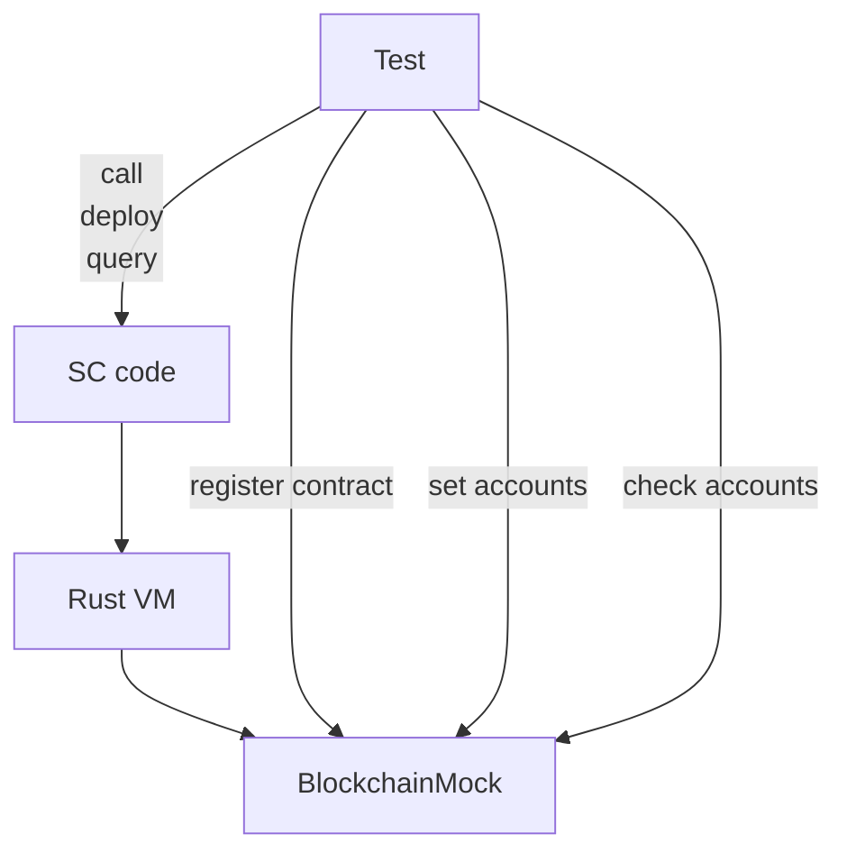
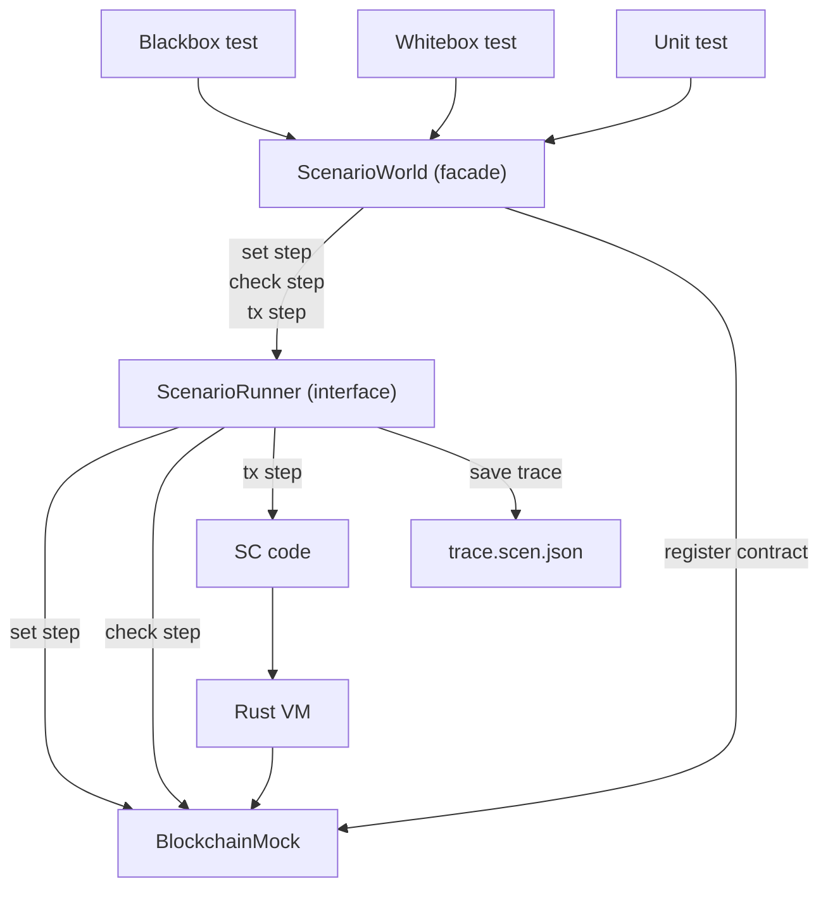

[comment]: # "mx-abstract"

## Overview

There are several ways to write smart contract tests in Rust directly. This is for the largest part possible because of the Rust VM and debugger that can act as an execution backend.

This is a simplified diagram of what a Rust test will do during its execution:

Of course, a local test environment is not a blockchain, so many things need to be mocked. The test state is held on a `BlockchainMock`, which needs to be initialized with user accounts, tokens, smart contracts, etc.

[comment]: # "mx-context-auto"

### ScenarioWorld (facade)

In order to simplify interactions with the system, all tests use a unique facade for all operations. It is called `ScenarioWorld`, and it gets created at the beginning of each test in a `world()` function.

[comment]: # "mx-context-auto"

### Registering contracts

Since we don't have native execution in the Rust backend yet, the only way to run contracts is to register the contract implementation for the given contract code identifier. In simpler words, we tell the environment "whenever you encounter this contract code, run this code that I've written instead".

Since this operation is specific to only the Rust debugger, it doesn't go through the mandos pipeline.

[comment]: # "mx-context-auto"

### Setting accounts

[comment]: # "mx-context-auto"

### Checking accounts

[comment]: # "mx-context-auto"

### Calling contract code

There are many ways to call contract code, but the one we recommend is [black-box style](sc-blackbox) using the [unified transaction syntax](/developers/transactions/tx-overview).

The call styles are:
- unified transaction syntax
    - [**black-box**](sc-blackbox) (recommended)
    - white-box (coming soon)
- Mandos steps in Rust (no longer recommended)
- [Whitebox framework (legacy)](whitebox-legacy)

[comment]: # "mx-context-auto"

## Rust testing architecture

We saw the simplified diagram in the introduction, now let's go in a little more depth.

The ScenarioWorld and its builders are in fact constructing mandos steps in the background and are sending them to the backends.

The tests are also allowed to construct these mandos steps themselves, but this is currently discouraged, because mandos syntax is very weakly typed and prone to error.

[comment]: # "mx-context-auto"

### ScenarioExecutor (Mandos)

All our tests run through a scenario (Mandos) execution layer, which is the reason why we are able to export mandos traces out of almost any test.

All test actions are converted to mandos steps before execution. This mechanism is designed to decouple the high-level code from the backend it is run on. In principle, these mandos steps could be executed on other backends too.

However, there are only two mandos executors right now:
- Rust VM backend
- save to file (trace).

The system can also load mandos scenarios from files and execute them as such, on the Rust VM backend.

