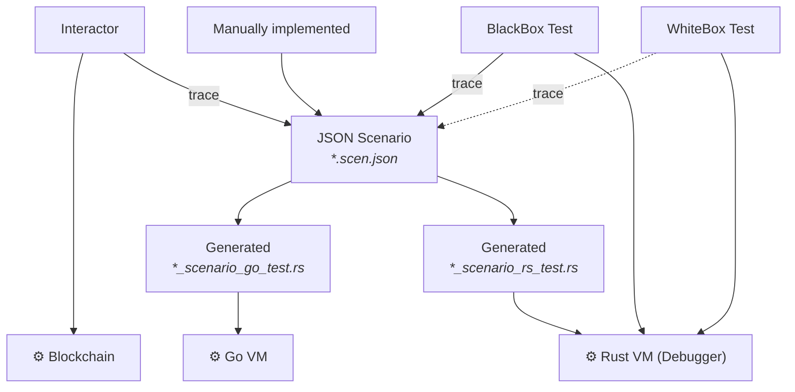

[comment]: # (mx-abstract)

There are currently several ways to generate scenarios.

The combination of generating and running scenarios is very powerful, since it means tests writtend originally for one system can be run of different systems too.

This diagram shows all the currently possible paths.

More details about this coming soon.

