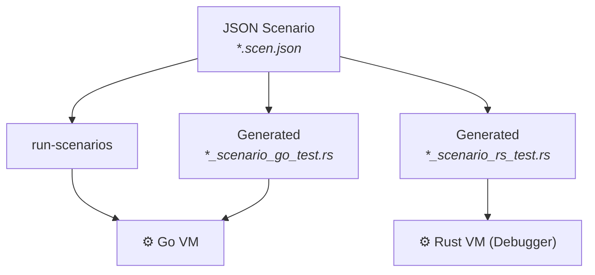

[comment]: # (mx-abstract)

Most of the MultiversX smart contract testing infrastructure is built with scenarios in mind, so there are lots of ways to execute them.



Assume we have a scenario JSON file. The options for running it are:
- using the `run-scenarios` standalone tool
- generating some tests in a Rust project and running the Rust tests.

[comment]: # (mx-context-auto)

## Standalone tool

The only standalone tool for running scenarios is `run-scenarios`, part of the VM tooling.

The binary is build from [here](https://github.com/multiversx/mx-chain-vm-go/blob/master/cmd/scenariostest/scenariosTest.go).
Most of the code lies [here](https://github.com/multiversx/mx-chain-vm-go/tree/master/scenarioexec), if you're curious.

To call, simply run `run-scenarios <path>`, where the path can be either a speciific scenario file, or a folder containing scenarios. In the case of a folder, the tool will run all files ending in `*.scen.json`. Results are printed to console.

[comment]: # (mx-context-auto)

## Integration in Rust

We normally want to integrate scenario tests in the CI. For this, at the very least we should write Rust tests that run the scenarios.

We have decided to have a separate Rust test for each scenario file. This way, when running a full test suite, it is easy to see exactly what test has failed, at a glance:


We also want to have a set of such tests for each of the backends: Go and Rust.

[comment]: # (mx-context-auto)

### Standard project layout

The standard for organising tests in a Rust crate is a follows:

```
├── Cargo.toml
├── meta
├── multiversx.json
├── output
├── scenarios
│   ├── scenario1.scen.json
│   └── scenario2.scen.json
├── src
│   └── my_contract.rs
├── tests
│   ├── my_contract_scenario_go_test.rs
│   ├── my_contract_scenario_rs_test.rs
│   ├── other_tests.rs
│   └── more_tests.rs
└── wasm
```

At a minimum, the project needs to have `src`, `meta`, and `wasm` folders.

Integration tests go into the `tests` folder. Scenario files, if present, should reside in a folder named `scenarios`. It is fine to also have sub-folders under `scenarios`, if needed.

The Rust tests should go into 2 files ending in `*scenario_go_test.rs` and `*scenario_rs_test.rs`, respectively. It is also acceptable to simply use file names `scenario_go_test.rs` and `scenario_rs_test.rs` directy, with no prefix, but having a prefix can help developers orient themselves easier in projects with many contracts.

[comment]: # (mx-context-auto)

### Go backend

The `*scenario_go_file.rs` should look like this:

```rust title="adder/tests/my_contract_scenario_go_test.rs"
use multiversx_sc_scenario::*;

fn world() -> ScenarioWorld {
    ScenarioWorld::vm_go()
}

#[test]
fn adder_go() {
    world().run("scenarios/adder.scen.json");
}

#[test]
#[ignore = "reason to ignore"]
fn ignored_test_go() {
    world().run("scenarios/ignored_test.scen.json");
}
```

The `world()` function sets up the environment, which in this case is very straightforward.

:::caution
Do not comment out tests!

Use the `#[ignore]` annotation instead (also writing a reason is nice, but optional).

The code generator for these files has trouble dealing with commented tests.

It also helps that ignored tests will also show up in console, unlike the ones that are commented out.
:::

It is customary to add a `_go` suffix to the test functions, to distinguish them from the ones with the Rust backend. The test-gen tool does the same.

[comment]: # (mx-context-auto)

### Rust backend

The `*scenario_rs_file.rs` needs more setup to the environment, but other than that it looks the same:

```rust title="adder/tests/my_contract_scenario_rs_test.rs"
use multiversx_sc_scenario::*;

fn world() -> ScenarioWorld {
    let mut blockchain = ScenarioWorld::new();
    blockchain.register_contract("file:output/adder.wasm", adder::ContractBuilder);
    blockchain
}

#[test]
#[ignore]
fn adder_rs() {
    world().run("scenarios/adder.scen.json");
}

#[test]
fn interactor_trace_rs() {
    world().run("scenarios/interactor_trace.scen.json");
}
```

Note that we can have different tests ignored on the different backends.

Here it is also customary to add a `_rs` suffix to the test functions, to distinguish them from the ones on the Go backend. The test-gen tool does the same.

[comment]: # (mx-context-auto)

### Rust backend environment minimal setup

The example above is a great example of a minimal setup. Other than creating the `world: ScenarioWorld` object, this is the line of interest:

```rust
blockchain.register_contract("file:<path to binary>", <contract_crate>::ContractBuilder);
```

The Rust backend doesn't run compiled contracts, instead, it hooks the actual Rust contract code to its engine. This is where we tell the framework how to do that.
The interpretation of this is:
- whenever the framework is asked to deploy or run a contract whose code would normally lie on disk at `<path to binary>` ...
- it should run the code, a prepared by `<contract_crate>::ContractBuilder`.

The path to binary is given as a scenario value expression. [The file syntax](/developers/testing/scenario/values-simple#file-contents) in the example is simply the most common way of loading a large value from file. It is also possible to provide the compiled contract as bytes, (e.g. `"0x0061736d0100000001661160000060017..."`), but hard-coding that is weird.

The `ContractBuilder` object is generated automatically for every contract, by the `#[multiversx_sc::contract]` procedural macro. That is why you won't see it in code, but it's always there.

[comment]: # (mx-context-auto)

### Auto-generating the boilerplate

If you thought "writing these test functions manually is tedious and repetitive", you would be correct. It is also error prone, since it is easy to accidentally leave scenarios out.

That is why we've build the [`sc-meta test-gen`](/developers/meta/sc-meta-cli#calling-test-gen) tool to help automate this task.

The tool works as follows:
- If no `*scenario_go_file.rs` or `*scenario_rs_file.rs` are found, they can be created anew, but only if the `--create` flag is passed to the tool.
- The Go VM tests can be fully generated, but the Rust VM environment setup (the `world()` function) cannot be generated automatically. When creating it for the first time, you will get a stub of thi function, and will have to fill in the implementation manually.
- If the `scenarios` folder is missing, the tool won't do anything.
- You will always get a test function for each scenario in the `scenarios` folder.
- The tool can be called any number of times, it is easy to update these tests whenever scenarios change. New scenario tests will be added and missing tests will be removed.
- The tool always preserves:
    - `#[ignore]` and `#[ignore = "reason"]` annotations;
    - Test comments;
    - Any additional code that may be written before the tests (not just the `world()` function).

The test tool can handle multiple contract crates at once. In fact, it will try to update tests for all contracts it can find under a given folder.

For reference, the tool paramters are:
- `--path`
    - Target directory where to call all contract meta crates.
    - _default_: current directory.
- `--ignore`
    - Ignore all directories with these names.
    - _default_: `target`.
- `--create`
    - Creates test files if they don't exist.

