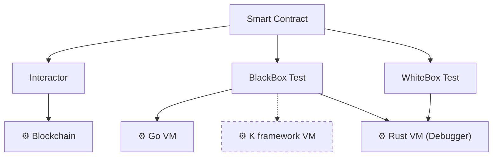

[comment]: # (mx-abstract)

What does it mean to test a smart contract?

Well, smart contracts are little programs that run on the blockchain, so the first step is to find an environment for them to run.

[comment]: # (mx-context-auto)

## Types of tests

The simplest answer would be to test them directly on a blockchain. We advise against testing them on mainnet, but we have the public devnet and testnet especially made for this purpose. It is even possible to run a blockchain on your local machine, this way there is no interference with anyone.

But testing on a blockchain can be cumbersome. It's a great way to test a final product, but until our product reaches maturity, we want something else. Our testing solution should be:
- fast,
- local,
- something that can we can automate (continuous integration is important1),
- something that we might also debug.

This is what integration tests are for. Conveniently, the MultiversX framework offers the possibility to run and debug smart contracts in a sandboxed environment that immitates a real blockchain. 

There are two flavors of integration tests:
- Black-box tests: execution immitates the blockchain, no access to private contract functions;
- White-box tests: the test has access to the inner workings of the contract.

They both have their uses and we will see more about them furter on.

There is a third type of test: the unit test. This is the most underrated type of test. It is ideal for testing a small function, or a small component of a smart contract. They are quick to write and quick to run. A healthy project should contain plenty of unit tests.

So, to recap, the ways to test a smart contract are as follows:
- On a blockchain,
- Integration tests:
    - Black-box tests,
    - White-box tests;
- Unit tests.

[comment]: # (mx-context-auto)

## What language should I use for my tests?

Since smart contracts are written in **Rust**, it is most convenient to have the tests also written in Rust. The Rust framework currently supports all types of testing mentioned above.

Let's, however, quickly go through all options avialable on MultiversX:
- On a blockchain:
    - Rust interactor framework;
    - [Any other SDK that can interact with the MultiversX blockchains](/sdk-and-tools/overview);
    - Launching transactions from the wallet diretly.
- Integration tests:
    - Black-box tests:
        - Rust,
        - JSON, via the [JSON scenarios](/developers/testing/scenario/structure-json),
        - Go, by building [around the Go VM tool](/developers/testing/testing-in-go);
    - White-box tests:
        - Rust only (since direct access to the contract code is needed);
- Unit tests:
    - Rust only (since direct access to the contract code is needed).

[comment]: # (mx-context-auto)

## Testing backends

A smart contract needs an environment to run. Any smart contract test needs to set up this environment. All these environments are modelled after the same blockchain, so their behavior is necessarily similar. This also means that in general, with some proper engineering, the same test should be able to run on any compatible infrastructure.

The backends are as follows:
- A blockchain
    - Can be thought of as the backend for blockchain interactions;
    - Currently the only place to test cross-shard transactions and contract calls.
- The Go VM:
    - The is the official VM, and currently the only VM implementation on a public MultiverX blockchain.
    - This is currently the most complete implementation. If there is any difference in VM execution, the Go VM is considered the correct implementation.
    - The only VM that can currently model gas.
- The Rust VM.
    - Alternative implementation of the VM, written specifically for testing and debugging contracts.
    - Is able to run contract code directly, without the need to compile contracts to WebAssembly.
    - Supports step-by-step debugging of contract code, for all types of tests.
    - Can provide code coverage.
- The K Framework VM specification.
    - Currently in the works. Only test prototypes are currently available.
    - It is a formal specification of WebAssembly and the MultiversX VM.
    - It is an _executable_ specification, can therefore be used as backend for tests.
    - Supports symbolic execution.

White-box and unit tests can only run on the Rust VM backend. For the black-box tests, however, all backends are available.

Interactors and black-box tests are very similar, so our goal is to at some point create a common test API that is compatible with all backends, including the real blockchain. We are half-way there.

