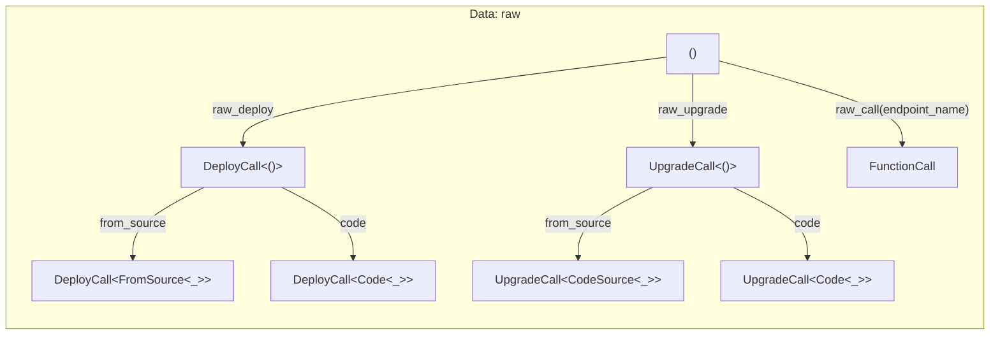
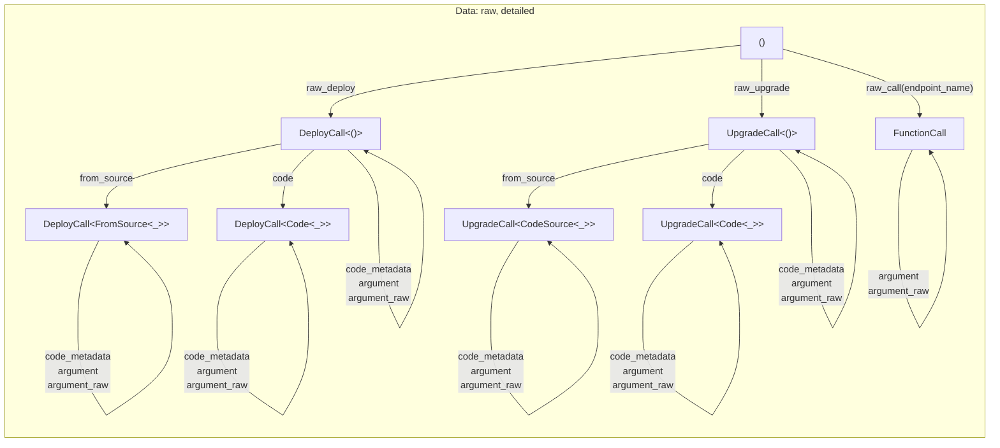

[comment]: # (mx-abstract)

## Overview

The data field can hold arbitrary data, but for practical purposes, it is normally one of three:

- a function call,
- deploy data, or
- an upgrade call.

We can always give this data in raw form, however, we usually prefer using a proper type system, for safety.

:::caution
Always use [proxies](./tx-proxies.md) when the target contract ABI is known. A contract proxy is a Rust equivalent of its ABI, and using adds invaluable type safety to your calls.

Using raw data is acceptable only when we are forwarding calls to unknown contracts, for instance in contracts like the multisig, governance of other forwarders.
:::

[comment]: # (mx-context-auto)

## Diagram

The basic transition diagram for constructing the data field is the one below. It shows the allowed data types and how to get from one to the other.

Notice how the deploy and upgrade calls are further specified by the code source: either explicit code, or the code of another deployed contract.



What the first diagram does **not** contain are some additional methods that change the values, but not the type. They are:

- `code_metadata` (deploy & upgrade only),
- `argument`
- `argument_raw`.

If we also add them to the diagram we get a more complex version of it:



:::info
These are diagrams for the raw calls, without proxies. You can find the one involving proxies [here](./tx-proxies.md#diagram).
:::

[comment]: # (mx-context-auto)

## No data

Transactions with no data are classified as simple transfers. These simple transactions can be transferred using:

- **`.transfer()`**: executes simple transfers with a zero gas limit.
```rust title=lib.rs
    self.tx()
        .to(&caller)
        .egld_or_single_esdt(&token_identifier, 0, &balance)
        .transfer();
```
- **`.transfer_if_not_empty()`**: it facilitates the transfer of funds with a zero gas limit only if the amount exceeds zero; otherwise, no action is taken.
```rust title=lib.rs
    self.tx()
        .to(ToCaller)
        .payment(&token_payment)
        .transfer_if_not_empty();
```


[comment]: # (mx-context-auto)

## Untyped function call

**`.raw_call(...)`** starts a contract call serialised by hand. It is used in proxy functions. It is safe to use [proxies](./tx-proxies.md) instead since manual serialisation is not type-safe.

[comment]: # (mx-context-auto)

### Argument

**`.argument(...)`** serializes the value, but does not enforce type safety. It adds one argument to a function call.

Can be called multiple times, once for each argument.

```rust
tx().raw_call("example").argument(&arg1).argument(&arg2)
```

It is safe to user [proxies](./tx-proxies.md) instead, whenever possible.

[comment]: # (mx-context-auto)

### Raw arguments

**`arguments_raw(...)`** overrides the entire argument buffer. It takes one argument of type `ManagedArgBuffer`. The arguments need to have been serialized beforehand.

```rust
tx().raw_call("example").arguments_raw(&arguments)
```

[comment]: # (mx-context-auto)

### Code metadata

**`.code_metadata()`** explicitly sets code metadata.
```rust
tx().raw_call("example").code_metadata(code_metadata)
```

[comment]: # (mx-context-auto)

## Untyped deploy

**`.raw_deploy()`** starts a contract deploy call serialised by hand. It is used in proxy deployment functions. It is safe to use [proxies](./tx-proxies.md) instead since manual serialisation is not type-safe. 

Deployment calls needs to set:

[comment]: # (mx-context-auto)

### Argument

Same as for [function call arguments](#argument).

```rust
tx().raw_deploy().argument(&argument)
```

[comment]: # (mx-context-auto)

### Raw arguments

Same as for [function call raw arguments](#raw-arguments).

```rust
tx().raw_deploy().arguments_raw(&arguments)
```

[comment]: # (mx-context-auto)

### Code

**`.code(...)`** explicitly sets the deployment code source as bytes.

Argument will normally be a `ManagedBuffer`, but can be any type that implements trait `CodeValue`.

```rust
tx().raw_deploy().code(code_bytes)
```


[comment]: # (mx-context-auto)

### From source

**`.from_source(...)`** will instruct the VM to copy the code from another previously deployed contract.

Argument will normally be a `ManagedAddress`, but can be any type that implements trait `FromSourceValue`.

```rust
tx().raw_deploy().from_source(other_address)
```

[comment]: # (mx-context-auto)

### New address

**`.new_address(...)`** defines a mock address for the deployed contract (allowed only in testing environments).
```rust
tx().raw_deploy().new_address(address)
```

The example below is a blackbox test for deploy functionality. This call encapsulates a raw_deploy that explicitly sets the deployment code source with *"adder.mxsc.json"* and the returned address of the deploy with *"sc: adder"*.

```rust title=adder_blackbox_test.rs
fn deploy(&mut self) {
    self.world
        .tx()
        .from(OWNER_ADDRESS)
        .raw_deploy()
        .argument(5u32)
        .code(CODE_PATH)
        .new_address(ADDER_ADDRESS)
        .run();
}
```

[comment]: # (mx-context-auto)

## Untyped upgrade

`.raw_upgrade()` starts a contract deployment upgrade serialised by hand. It is used in a proxy upgrade call. It is safe to use [proxies](./tx-proxies.md) instead since manual serialisation is not type-safe. All upgrade calls require:

[comment]: # (mx-context-auto)

### Argument

Same as for [function call arguments](#argument).

```rust
tx().raw_upgrade().argument(&argument)
```

[comment]: # (mx-context-auto)

### Raw arguments

Same as for [function call raw arguments](#raw-arguments).

```rust
tx().raw_upgrade().arguments_raw(&arguments)
```

[comment]: # (mx-context-auto)

### Code metadata

Same as for [function call raw arguments](#code-metadata).
```rust
tx().raw_upgrade().code_metadata(code_metadata)
```

[comment]: # (mx-context-auto)

### Code

Same as for [deploy code](#code).

Argument will normally be a `ManagedBuffer`, but can be any type that implements trait `CodeValue`.

```rust
tx().raw_upgrade().code(code_bytes)
```

[comment]: # (mx-context-auto)

### From source

Same as for [deploy from source](#from-source).

**`.from_source(...)`** will instruct the VM to copy the code from another previously deployed contract.

Argument will normally be a `ManagedAddress`, but can be any type that implements trait `FromSourceValue`.

```rust
tx().raw_upgrade().from_source(other_address)
```

The example below is an endpoint that contains upgrade functionality. This call encapsulates a raw_upgrade that explicitly sets the upgrade call source with a specific ManagedAddress and *upgradeable* code metadata.

```rust title=contract.rs
#[endpoint]
fn upgrade_from_source(
    &self,
    child_sc_address: ManagedAddress,
    source_address: ManagedAddress,
    opt_arg: OptionalValue<ManagedBuffer>,
) {
    self.tx()
        .to(child_sc_address)
        .typed(contract_proxy::ContractProxy)
        .upgrade(opt_arg)
        .code_metadata(CodeMetadata::UPGRADEABLE)
        .from_source(source_address)
        .upgrade_async_call_and_exit();
}
```
