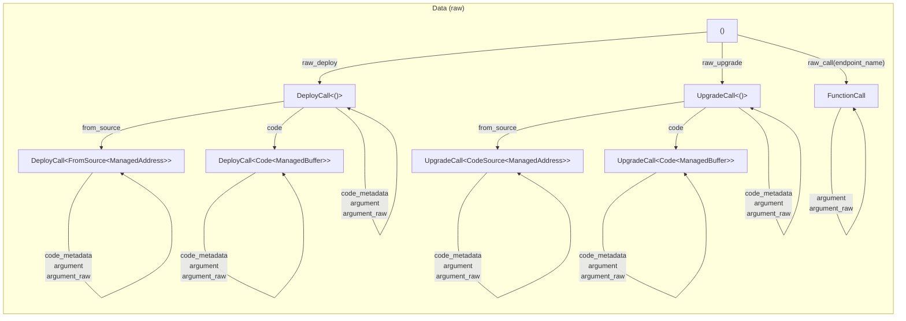
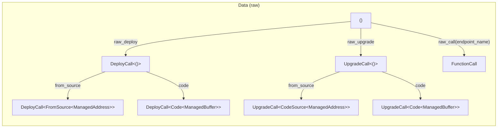

[comment]: # (mx-abstract)

The data field can hold arbitrary data, but for practical purposes, it is normally one of three:
- a function call,
- deploy data, or
- an upgrade call.

We can always give this data in raw form, however, we usually prefer using a proper type system, for safety.

:::caution
Always use [proxies](tx-proxies) when the target contract ABI is known. A contract proxy is a Rust equivalent of its ABI, and using adds invaluable type safety to your calls.

Using raw data is acceptable only when we are forwarding calls to unknown contracts, for instance in contracts like the multisig, governance of other forwarders.
:::


[comment]: # (mx-context-auto)

## Diagram

This is the diagram for the raw calls, without proxies. You can find the one involving proxies [here](tx-proxies#diagram)






[comment]: # (mx-context-auto)

## No data

Transactions with no data are classified as simple transfers. These simple transactions can be transferred using:
- **`.transfer()`**: executes simple transfers with a zero gas limit.
```rust title=lib.rs
    self.tx()
        .to(&caller)
        .egld_or_single_esdt(&token_identifier, 0, &balance)
        .transfer();
```
- **`.transfer_if_not_empty()`**: it facilitates the transfer of funds with a zero gas limit only if the amount exceeds zero; otherwise, no action is taken.
```rust title=lib.rs
    self.tx()
        .to(ToCaller)
        .payment(&token_payment)
        .transfer_if_not_empty();
```
[comment]: # (mx-context-auto)

Inside a contract, all transactions are treated as untyped function calls. This applies to system smart contracts, calls, and even built-in functions.

[comment]: # (mx-context-auto)

## Untyped deploy

**`.raw_deploy()`** starts a contract deploy call serialised by hand. It is used in proxy deployment functions. It is safe to use [proxies](tx-proxies) instead since manual serialisation is not type-safe. All deployment calls require the following:
  - **`.code()`**: explicitly sets the deployment code source as a byte array.
  - **`.new_address()`**:  defines a mock address for the deployed contract (allowed only in testing environments).

If you want to set code metadata, you can use **`.code_metadata()`**.

The example below is a blackbox test for deploy functionality. This call encapsulates a raw_deploy that explicitly sets the deployment code source with *"adder.mxsc.json"* and the returned address of the deploy with *"sc: adder"*.


```rust title=adder_blackbox_test.rs
const OWNER_ADDRESS: TestAddress = TestAddress::new("owner");
const ADDER_ADDRESS: TestSCAddress = TestSCAddress::new("adder");
const CODE_PATH: MxscPath = MxscPath::new("output/adder.mxsc.json");

fn deploy(&mut self) {
    self.world
        .tx()
        .from(OWNER_ADDRESS)
        .typed(adder_proxy::AdderProxy)
        .init(5u32)
        .code(CODE_PATH)
        .new_address(ADDER_ADDRESS)
        .run();
}
```
[comment]: # (mx-context-auto)

## Untyped upgrade

`.raw_upgrade()` starts a contract deployment upgrade serialised by hand. It is used in a proxy upgrade call. It is safe to use [proxies](tx-proxies) instead since manual serialisation is not type-safe. All upgrade calls require:
 - **`.code()`**

If you want to set code metadata in the upgrade, you can use **`.code_metadata()`**.

[comment]: # (mx-context-auto)

### From source

**`.from_source()`** sets the upgrade code source as another deployed contract code.
```rust title=lib.rs
#[endpoint]
fn upgrade_from_source(
    &self,
    child_sc_address: ManagedAddress,
    source_address: ManagedAddress,
    opt_arg: OptionalValue<ManagedBuffer>,
) {
    self.tx()
        .to(child_sc_address)
        .typed(contract_proxy::ContractProxy)
        .upgrade(opt_arg)
        .code_metadata(CodeMetadata::UPGRADEABLE)
        .from_source(source_address)
        .upgrade_async_call_and_exit();
}
```
