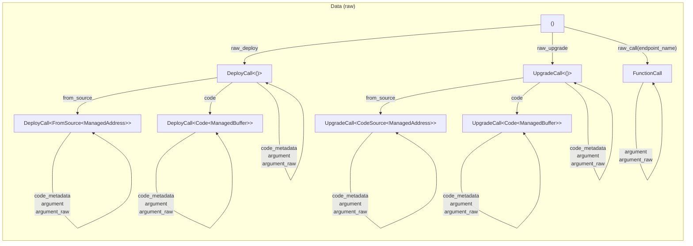

[comment]: # (mx-abstract)

The data field can hold arbitrary data, but for practical purposes, it is normally one of three:
- a function call,
- deploy data, or
- an upgrade call.

We can always give this data in raw form, however, we usually prefer using a proper type system, for safety.

:::caution
Always use [proxies](tx-proxies) when the target contract ABI is known. A contract proxy is a Rust equivalent of its ABI, and using adds invaluable type safety to your calls.

Using raw data is acceptable only when we are forwarding calls to unknown contracts, for instance in contracts like the multisig, governance of other forwarders.
:::

[comment]: # (mx-context-auto)

## Diagram

This is the diagram for the raw calls, without proxies. You can find the one involving proxies [here](tx-proxies#diagram)

[comment]: # (mx-context-auto)

## No data

- simple transfers

[comment]: # (mx-context-auto)

## Untyped function call

- contract call (incl system SC call)
- builtin function call

[comment]: # (mx-context-auto)

## Untyped deploy

- `.raw_deploy()`
- code metadata

[comment]: # (mx-context-auto)

### Code

[comment]: # (mx-context-auto)

### From source

[comment]: # (mx-context-auto)

## Untyped upgrade

- `.raw_upgrade()`
- code metadata

[comment]: # (mx-context-auto)

### Code

[comment]: # (mx-context-auto)

### From source
