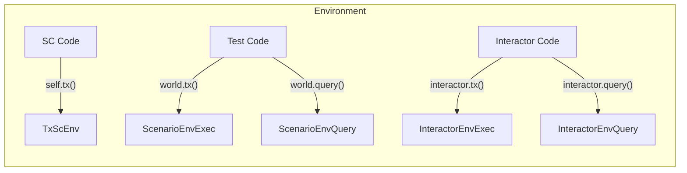

[comment]: # (mx-abstract)

## Overview

When discussing the unified transaction syntax, we identify four primary environments crucial for developing and deploying secure smart contracts on MultiversX. This design aims to cover all essential development stages, ensuring a seamless workflow. Notably, it streamlines the process for Rust developers by empowering them to solely concentrate on mastering Rust. As a result, they can effortlessly write, test, deploy, and interact with smart contracts without the burden of learning additional complementary technologies.

The environments:
- Smart contract - Rust framework, the syntax for writing smart contracts (`TxScEnv`)
- Integration test - Rust testing framework, used for writing Rust tests against the Rust VM and Go VM (`ScenarioTxEnv`, `ScenarioEnvExec`, `ScenarioTxEnvData`, `ScenarioEnvQuery`)
- Parametric test - symbolic execution, safety of the smart contract code (coming soon)
- Interactor - Rust microservice, used for system testing and interaction with the smart contract on the real blockchain (`InteractorExecEnv`, `InteractorQueryEnv`)

:::info
The Rust unified syntax is able to interact with all of these environments, meaning that the syntax remains the same for all purposes mentioned above. The only element that changes the route of the transaction (whether it's going to be run inside a `smart contract`, `test`, or `interactor`) is the environment `TxEnv`. 

Creating a transaction with a specific environment gives the developer access to the specific functions used in said environment only. 
:::

Switching between environments is accessible for the developer and enforced by the Rust type system. Each environment is represented by a different type, and switching between environments can be easily done by specializing the `TxEnv` generic of the transaction with a concrete value from the pool of available environments. 

Each transaction starts from the environment, then multiple smaller bits of information are added in a modular way so that the generics of the `Tx` object are instantiated one by one and the route of the transaction is defined. The developer is not forced to complete the transaction in any way, but the route of the transaction is narrowed down by the types used at every step. 

For example, let's suppose we are in the smart contract environment of `SomeContract`:

```rust title=lib.rs
#[multiversx_sc::contract]
pub trait SomeContract {

    #[endpoint]
    fn deploy_another_contract(
        &self,
        source: ManagedAddress,
        deploy_arg: Option<u64>
    ) {
        self.tx() // TxScEnv - smart contract environment
            .raw_deploy() // TxScEnv + DeployCall - deploy tx in a sc environment
            .from_source(source) // deploy detail, further defines DeployCall
            .argument(&deploy_arg) // deploy argument
            .sync_call() // type of call
    }
}
```

In this example, the endpoint `deploy_another_contract` performs a smart contract deploy action with specific parameters. First, we create a transaction with `self.tx()`, which automatically translates to a transaction with the `TxScEnv` environment when called from inside the smart contract. Then, we add bits of information to the transaction, such as the type of action we are looking for: `.raw_deploy()`. This narrows down our environment to `TxScEnv` and also specializes our `TxData` generic field as a `DeployCall`, which now creates a route for our transaction (deploy) and gives us access to other functions that can help the deploy action only.

:::info
Once the environment is selected, developers have four methods to narrow down the route of the transaction:
- `.raw_call("function_name")` - creates a raw call to a smart contract (function name can also be empty)
- `.raw_deploy()` - creates a deploy call, can not have a recipient
- `.raw_upgrade()` - creates an upgrade call
- `.typed(proxy::ContractProxy)` - creates a typed call through a contract proxy, knows the expected return type of the endpoint
:::

:::note
Apart from the environment, developers are not obliged to include any specific details within a transaction. They have the freedom to construct the transaction in any manner they see fit, provided that the transaction ultimately contains sufficient information to execute the intended action accurately.
:::


[comment]: # (mx-context-auto)

## Diagram

Environments are the first field that gets initialized, as soon as the transaction object is created.



[comment]: # (mx-context-auto)

## Smart contract

A transaction with the smart contract environment can be created from inside the smart contract (annotated with `#[multiversx_sc::contract]`), by simply calling `self.tx()`. The returned transaction env is `TxScEnv` by default, which helps us build transactions in this environment.

```rust title=lib.rs
#[multiversx_sc::contract]
pub trait SomeContract {
    #[endpoint]
    fn send_async_call(
        &self,
        to: ManagedAddress,
        function_name: ManagedBuffer,
        args: ManagedArgBuffer<Self::Api>,
    ) {
        self.tx() // tx with sc environment
            .to(to) // recipient
            .raw_call(function_name) // function call
            .arguments_raw(args) // arguments
            .async_call_and_exit() // type of call - async
    }
}
```


[comment]: # (mx-context-auto)

## Integration test

When building integration tests, we have to deal with the test environments such as `ScenarioEnvExec` for sending transactions and `ScenarioEnvQuery` for querying results from smart contracts. The easiest way to create transactions with the test environments is to create an instance of the `ScenarioWorld` struct.

```rust title=blackbox_test.rs
use multiversx_sc_scenario::imports::*;

mod proxy;

#[test]
fn blackbox_test() {
    let mut world = ScenarioWorld::new(); // ScenarioWorld struct

    let _query_env = world.query(); // tx with ScenarioEnvQuery
    let _tx_env = world.tx(); // tx with ScenarioEnvExec
}
```

After defining the environment, we can further build transactions, as such:

```rust title=blackbox_test.rs
use multiversx_sc_scenario::imports::*;

mod proxy;

const OWNER_ADDRESS: TestAddress = TestAddress::new("owner");
const CODE_PATH: MxscPath = MxscPath::new("output/some-contract.mxsc.json");

#[test]
fn blackbox_test() {
    let mut world = ScenarioWorld::new(); // ScenarioWorld struct

    let new_address = world
        .tx() // tx with test exec environment
        .from(OWNER_ADDRESS) // caller
        .typed(proxy::SomeContractProxy) // typed call
        .init() // calling init function => deploy
        .code(CODE_PATH) // deploy detail
        .returns(ReturnsNewAddress) // result handler - expected return type
        .run(); // runs the step

    let _result = world
        .query() // tx with test query environment
        .to(new_address) // newly deployed sc address
        .typed(proxy::SomeContractProxy) // typed call
        .sum() // smart contract view 
        .returns(ReturnsResult) // result handler - expected return type
        .run(); // runs the step
}
```


[comment]: # (mx-context-auto)

## Parametric tests

Not yet available, coming soon.

## Interactor

The interactors are microservices written in Rust, used for interacting with the smart contract on the real blockchain (deploy/upgrade, query, call) and system testing. Interactor environments such as `InteractorExecEnv` and `InteractorQueryEnv` are essential for transactions meant to be ran on the real blockchain, from a different environment than the smart contract. The easiest way to create transactions using the interactor environments is to create an instance of the `Interactor` struct.

```rust title=interact.rs
const GATEWAY: &str = "https://devnet-gateway.multiversx.com";

async fn example_scenario() {
    let mut interactor = Interactor::new(GATEWAY).await; // Interactor struct

    let _query_env = interactor.query(); // tx with InteractorQueryEnv
    let _tx_env = interactor.tx(); // tx with InteractorExecEnv
}
```

After creating the transaction with the interactor environment, we can start building transactions that will run on the real blockchain, as such:

```rust title=interact.rs
use multiversx_sc_snippets::imports::*;

mod proxy;

const GATEWAY: &str = "https://devnet-gateway.multiversx.com";

async fn example_scenario() -> num_bigint::BigUint {
    let mut interactor = Interactor::new(GATEWAY).await; // create Interactor struct
    let wallet_address = interactor.register_wallet(test_wallets::mike()); // register a test wallet from the framework
    let sc_address = Bech32Address::from_bech32_string(
        "erd1qqqqqqqqqqqqqpgqtsw8s3evhhyqqa2j2tfn9yvufqskdv236n9s2a06h9".to_string(),
    ); // actual smart contract address on devnet

    interactor
        .tx() // tx with interactor exec environment
        .from(&wallet_address) // caller is test wallet
        .to(&sc_address) // recipient
        .typed(proxy::SomeContractProxy) // typed call
        .add(5u64) // contract endpoint
        .prepare_async() // prepares tx data, async Rust (different from async blockchain tx)
        .run() // runs the transaction
        .await; // awaits response

    interactor
        .query() // tx with interactor query environment
        .to(&sc_address) // recipient
        .typed(proxy::SomeContractProxy) // typed call
        .sum() // contract view, returns value
        .returns(ReturnsResultUnmanaged) // result handler - expected return type, converted for ease of use
        .prepare_async() // prepares tx data, async Rust (different from async blockchain tx)
        .run() // runs the transaction
        .await // awaits and returns response
}
```
For the moment, every interactor transaction needs to go through `prepare_async` in order to convert tx data to other needed types. The function does `not` create an async blockchain call, rather it refers to async Rust.


As seen above, the transaction syntax remains consistent over the various environments. The developer can further improve the microservice by including the scenario function into a CLI or writing system tests. 

For example, a system test can look like this:
```rust title=interact.rs
#[cfg(test)]
pub mod system_test {
    use crate::example_scenario;
    use multiversx_sc_snippets::tokio;

    #[tokio::test]
    async fn test_full_farm_scenario() {
        let result = example_scenario().await;
        println!("result {:#?}", result);
    }
}
```

Running this test will call the `add` endpoint of the contract, query the `sum` view to get the result value (on the devnet, according to the gateway and test wallet), convert it into a similar type that doesn't require an API (in this case from `multiversx_sc::types::Biguint` to `num_bigint::BigUint`) and print it in the console. 

:::info
For ease of use, a small interactor CLI built around a smart contract's endpoints can now be `generated automatically` using [sc-meta all snippets](/developers/meta/sc-meta-cli#calling-snippets).
:::
