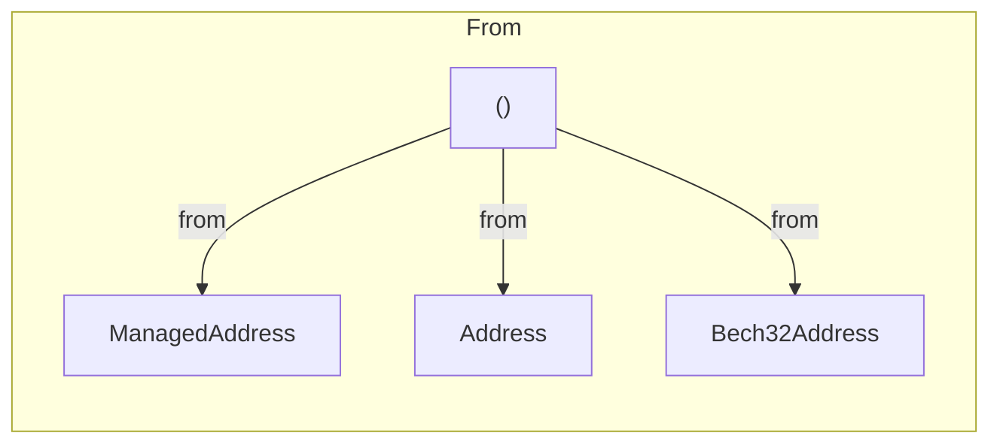

[comment]: # (mx-abstract)

## Overview

Within the context of a transaction that comprises seven distinct generics, `From` represents the **second** generic field — **the entity that initiates the transaction**. It is required in three environments: the integration test, the parametric test, and the interactor.

A transaction originating from a contract environment cannot have a sender in the contract environment. The reason is that the current contract is always the same: the contract that starts the transaction.


[comment]: # (mx-context-auto)

## Diagram

The sender is being set using the `.from(...)` method. Several types can be specified:



[comment]: # (mx-context-auto)

## No sender

Transactions initiated in the **contract environment** have no sender specified. There is no need for sender identification because it always refers to the executing contract itself.

```rust title=contract.rs
#[payable("EGLD")]
#[endpoint]
fn transfer_egld(&self, to: ManagedAddress, amount: BigUint) {
    self.tx().to(&to).egld(&amount).transfer();
}
```

[comment]: # (mx-context-auto)

## Explicit sender

For transactions launched in any other environment than the contract one, it is required to specify the sender. Meaning that, in most cases, no tx can be created without defining the sender.

In the following section, we will outline the various types of entities that can be designated as the sender in a transaction.

### ManagedAddress

The function below is a snippet from an interactor whose purpose is to deploy a contract. The `.from` call, which sets the sender, is the main focus of this example. The sender is a hardcoded ManagedAddress, which illustrates a wallet.

```rust title=interact.rs
async fn deploy(&mut self) {
    let wallet: ManagedAddress<StaticApi> = ManagedAddress::new_from_bytes(&[7u8; 32]);

    self.interactor
        .tx()
        .from(wallet)
        .typed(proxy::Proxy)
        .init(0u32)
        .code(&self.code)
        .gas(NumExpr("70,000,000"))
        .returns(ReturnsNewBech32Address)
}
```

### Address

The example beneath is a fragment for a blackbox test that runs the add function from a proxy. The sender is received as a parameter in this function.
```rust title=blackbox_test.rs
fn add_one(&mut self, from: &AddressValue) {
    self.world
        .tx()
        .from(from)
        .to(self.receiver)
        .typed(proxy::Proxy)
        .add(1u32)
        .run();
}
```

For parametric testing, there is particular address type name:
- **TestAddress**
  - encodes a dummy address, equivalent to `"address:{}"`; for the example below it is equivalent to `"address:owner"`;
  - contains two functions:
    - **`.eval_to_array()`** parse the address into an array of u8
    - **`.eval_to_expr()`** return the address as a String object
```rust title=blackbox_test.rs
const OWNER_ADDRESS: TestAddress = TestAddress::new("owner");

fn add_one(&mut self) {
    self.world
        .tx()
        .from(OWNER_ADDRESS)
        .to(self.receiver)
        .typed(proxy::Proxy)
        .add(1u32)
        .run();
}
```
### Bech32Address
In order to avoid repeated conversions, it keeps the **bech32** representation **inside**. It wraps the address and presents it as a bech32 expression.
```rust title=interact.rs
fn add_one(&mut self, wallet_address: Bech32Address) {
    self.world
        .tx()
        .from(wallet_address)
        .to(self.receiver)
        .typed(proxy::Proxy)
        .add(1u32)
        .run();
}
```

## Automatic wallet selection in interactors

Wallets are registered beforehand when it comes to interactor operations. An automated signature is applied to the transaction. More details about interactors here.
