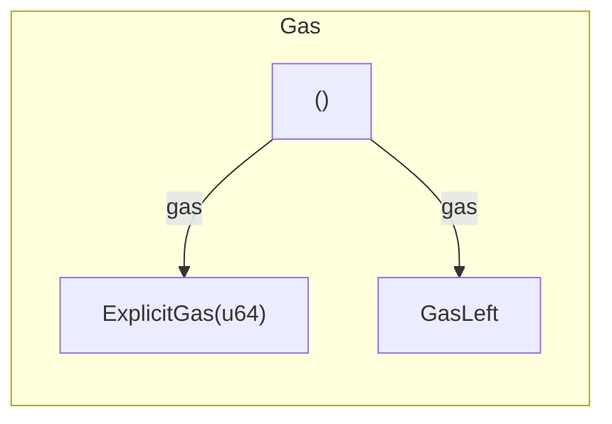

[comment]: # (mx-abstract)

## Overview

**`Gas`** is the fourth generic that originated from a transaction. It sets an explicit gas limit for the call. Some transactions require explicit gas, others do not necessitate it.

[comment]: # (mx-context-auto)

## Diagram

The gas limit can be set using the `.gas(...)` method. Gas is normally represented as a `u64` value.




[comment]: # (mx-context-auto)

## Default gas

Transactions that do not contain the **`.gas()`** call have a default gas limit of **5,000,000**. This is relevant only in MandosGO because RustVM does not measure.

Simple transfers, of which VM is aware, that have no payload do not need to explicitly set the gas limit. It extracts the gas left. The default leftover is **100,000** so in case there is no more gas left, the current calling transaction is set to finish.

For interactors, there is a default amount of **5,000,000** set. If a different amount is needed than the default one, it can be changed, like in the example below.

```rust title=interactor.rs
fn register(&mut self, name: &str, address: Address) {
    self.interactor
        .tx()
        .from(&self.wallet_address)
        .to(self.contract )
        .gas(NumExpr("30,000,000"))
        .typed(proxy::Proxy)
        .register(address, name)
        .prepare_async()
        .run()
        .await;
}
```

### Optional gas

- **`.async_call()`**: since v0.49.0, this is a legacy function.
- **`.sync_call()`**: synchronously deploys a contract from source. For transactions that do not contain a payload, it is not necessary to set explicit gas. By default, the gas limit is set to the gas left. Executes transactions performed in the same context as the name of the caller. Equivalent to `.execute_on_dest_context()` from versions lower than `v0.49.0`.
[comment]: # (mx-context-auto)

## Explicit gas

Any **interactor call** that needs a higher amount than the default one is necessary to set using `.gas()`. You can find an example in the *Default Section*.

The same rule is applied to functions created in integration testing (the blackbox test).

If the transfer is executed with a payload, then **the gas must be explicitly specified**. The example below is a snippet from a contract that sets explicit the gas in the transaction because the deploy call contains an argument_raw.
```rust title=lib.rs
#[endpoint]
fn deploy_from_source(
    &self,
    source_contract_address: ManagedAddress,
    code_metadata: CodeMetadata,
    args: MultiValueEncoded<ManagedBuffer>,
) -> ManagedAddress {
    self.tx()
        .raw_deploy()
        .from_source(source_contract_address)
        .code_metadata(code_metadata)
        .arguments_raw(args.to_arg_buffer())
        .gas(self.blockchain().get_gas_left())
        .returns(ReturnsNewManagedAddress)
        .sync_call()
}
```

