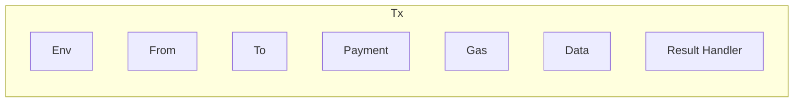
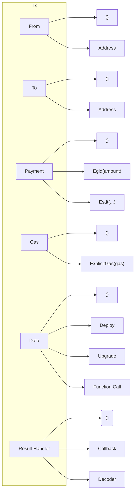

[comment]: # (mx-abstract)

- in depth documentation
- jump to examples

[comment]: # (mx-context-auto)

## Motivation

## Transaction builder

## The `Tx` object

```mermaid
graph LR
    subgraph Tx
        Env
        From
        To
        Payment
        Gas
        Data
        rh[Result Handler]
    end

```

## Generics

```mermaid
graph LR
    subgraph Tx
        From
        To
        Payment
        Gas
        Data
        rh[Result Handler]
    end
    From --> from-unit["()"]
    From --> from-address[Address]
    To --> to-unit["()"]
    To --> to-address[Address]
    Payment --> payment-unit["()"]
    Payment --> egld["Egld(amount)"]
    Payment --> esdt["Esdt(...)"]
    Gas --> gas-unit["()"]
    Gas --> gas-explicit["ExplicitGas(gas)"]
    Data --> data-unit["()"]
    Data --> Deploy
    Data --> Upgrade
    Data --> fc[Function Call]
    rh --> rh-unit("()")
    rh --> Callback
    rh --> Decoder
```