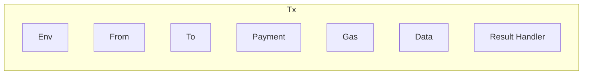
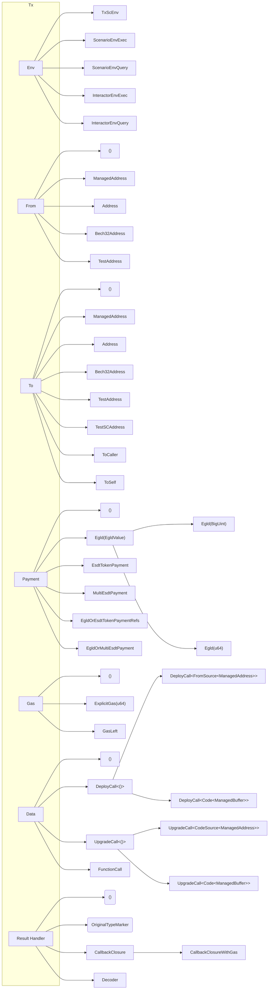
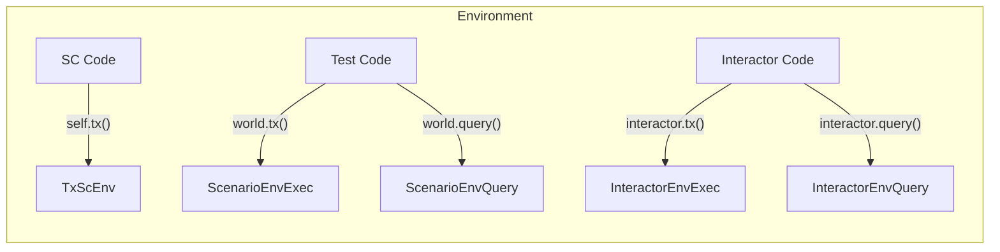
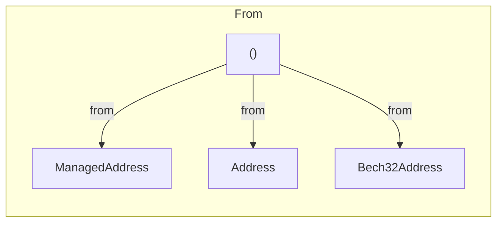
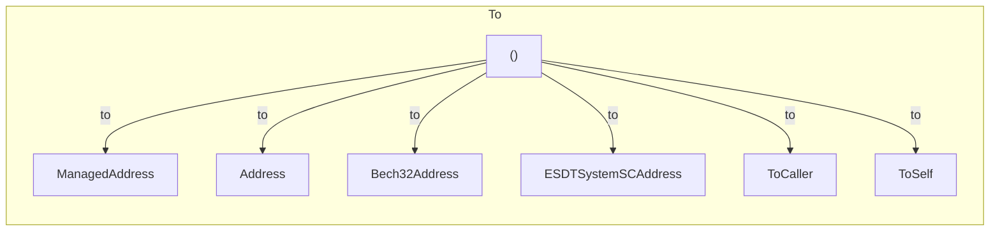
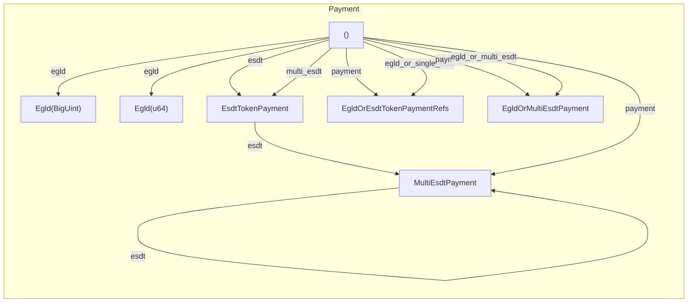
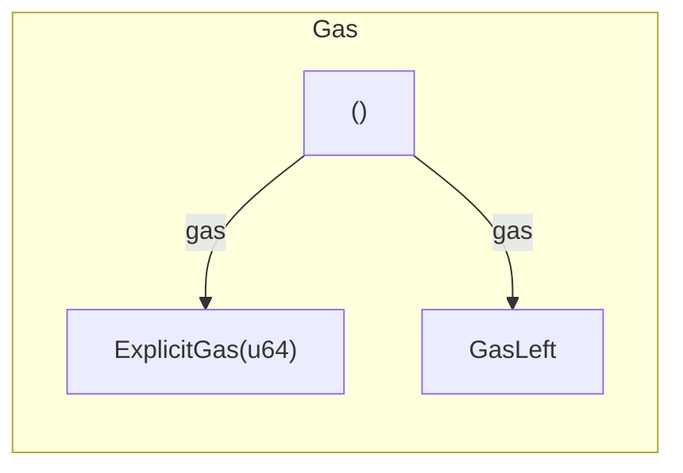
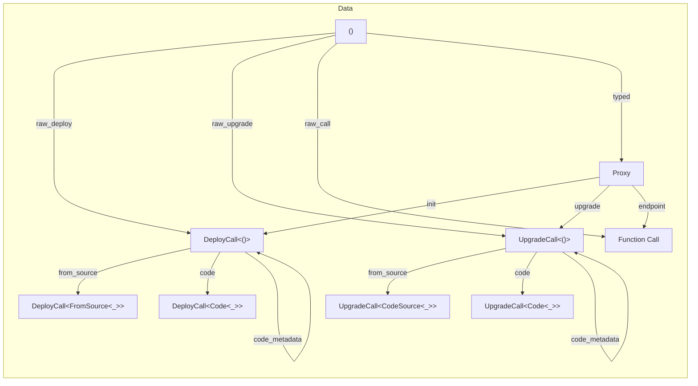
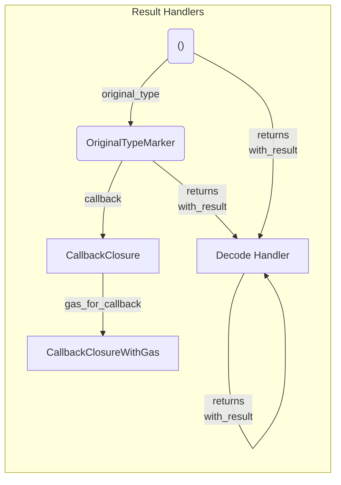

[comment]: # (mx-abstract)

A big part in the life of a blockchain developer is to create and launch blokchain transactions.

Whether it's an off-chain tool, smart contract code, or a testing scenario, it is important that we have a powerful syntax to express any conceivable transaction.

At some point in the development of the development framework, we realized that the following are equivalnbet to a large extent, and could be expressed using the same syntax:
- transactions launched from smart contracts,
- blackbox integration tests,
- off-chain calls.

We called this "unified transaction syntax", or "unified syntax", and the first version of it was released in [multiversx-sc version 0.49.0](https://github.com/multiversx/mx-sdk-rs/releases/tag/v0.49.0).

In this documentation, you will get a complete explanation of all the features of this syntax, organized around the various components of a blockchain transaction. However, you can also jump to the [examples](tx-examples) page straight away.


[comment]: # (mx-context-auto)

## Motivation and design

Transactions can be fairly complex, and in order to get them to use the same syntax in very different environments, we had a few challenges:

1. Transactions have many fields, which can be configured in many ways. It is important to be able to configure most of them independently, otherwise the framework becomes too large, or unreliable.
2. Since this syntax is also used in contracts, it was essential to choose a design that adds almost no runtime and code size overhead. So the syntax must make heavy use of generics, to resolve at compile-time all type checks, conversions, and restrictions.
3. Also because syntax is used in contracts, it had to rely on managed types.
4. We wanted as much type safety as possible, so we had to find a way to rely on the ABI to produce type checks both for contract inputs and outputs.


[comment]: # (mx-context-auto)

## The `Tx` object

We decided to model all transactions using a single object, but with exactly 7 generic arguments, one for each of the transaction fields.



<br />

Each one of these 7 fields has a trait that governs what types are allowed to occupy the respective position.

All of these positions (except the environment `Env`) can be empty, unitialized. This is signalled at compile time by the unit type, `()`. In fact, a transaction always starts out with all fields empty, except for the environment.

For instance, if we are in a constract and write `self.tx()`, the universal start of a transaction, the resulting type will be `Tx<TxScEnv<Self::Api>, (), (), (), (), (), ()>`, where `TxScEnv<Self::Api>` is simply the smart contract call environment. Of course, the transaction at this stage is unusable, it is up to the developer to add the required fields and send it.


[comment]: # (mx-context-auto)

## The `Tx` fields

We have dedicated a page to each of these 7 fields:

| Field                                   | Description| 
| --------------------------------------- | --- |
| [Environment](tx-env)                   | Some representation of the environment where the transaction runs. Adds context  |
| [From](tx-from)                         | The transaction sender. Implicit for SC calls (the contract is the sender), but mandatory anywhere else. |
| [To](tx-to)                             | The receiver. Needs to be specified for any transaction expect for deploys. |
| [Payment](tx-payment)                   | Optional, can be EGLD, single or multi-ESDT. We also have some payment types that get decided at runtime. |
| [Gas](tx-gas)                           | Some transactions need explicit gas, others don't. |
| [Data](tx-data)                         | Proxies (ideally) or raw | The main part of the payload. Can be inhabited by a function call, deploy data, upgrade data, or nothing, in the case of direct transfers.|
| [Result Handlers](tx-result-handlers)   | Anything that deals with results, from callbacks to decoding logic. |

We could also group them in threee broad categories:
- The [environment](tx-env) is its own category, pertaining to both **inputs and outputs**.
- 5 **inputs**: [From](tx-from), [To](tx-to), [Payment](tx-payment), [Gas](tx-gas), [Data](tx-data).
- 1 field dealing with the **output**: [the result handlers](tx-result-handlers).


## Transaction builder

Now that we've seen what the contents of a transaction are, let's see how we can specify them in code.

Of course, the developer shouldn't access the fields of the transaction directly. There is sort of a builder pattern when constructing a transaction.

In its most basic form, a transaction might be constructed as follows:

```rust
self.tx()
    .from(from)
    .to(to)
    .payment(payment)
    .gas(gas)
    .raw_call("function")
    .with_result(result_handler)
```

:::caution Important
While this may look like a traditional OOP builder pattern, there is one important aspect to point out:

*Each of these setters outputs a type that is different from its input.*

We are not merely setting new data into an existing field, we are also specifying the type of each field, at compile-time. At each step we are not only specifying the data, but also the types.
:::

Even though these look like simple setters, we are first of all constructing a type using this syntax.

Also note that the way these methods are set up, it is impossible to call most of them twice. They only work when the respective field is not yet set (of unit type `()`), so writing something like `self.tx().from(a).from(b)` causes a compiler error.

Here we have some of the most common methods used to construct a transaction:

| Field                                   | Filed name | Initialize with | 
| --------------------------------------- | --- | --- | 
| [Environment](tx-env)                   | `env` | `.tx()` | 
| [From](tx-from)                         | `from` | `.from(...)` | 
| [To](tx-to)                             | `to` | `.to(...)` | 
| [Payment](tx-payment)                   | `payment` | `.payment(...)` | 
| [Gas](tx-gas)                           | `gas` | `.gas(...)` | 
| [Data](tx-data)                         | `data` | `.typed(...)` (ideally)  <br /> `.raw_call(...)` <br /> `.raw_deploy()` <br /> `.raw_upgrade()`|
| [Result Handlers](tx-result-handlers)   | `result_handler` | `.callback(...)` <br /> `.returns(...)` <br /> `.with_result(...)` | 

The list is by no means exhaustive, just an initial overview. Please find the full documentation in each of the linked pages.


## Execution

Ultimately, the purpose of a transaction is to be executed. Simply constructing a transaction has no effect in itself. So we must finalize each transaction construct with a call that sends it to the blockchain.

The allowed execution methods depend on the environment. More specifically:
- In a contract the options are `.transfer()`, `.transfer_execute()`, `.async_call_and_exit()`, `.sync_call()`, etc.
- In tests just `.run()` is universal.
- In interactors, because if the use of async Rust, we need to write `.prepare_async().run().async`.

More on this in the [launch page](tx-run). 

## Map of the fields types

We're adding a graph of what the common types are that fit in each of the transaction fields.





## Map of the setters

Constructing a transaction is similar to exploring a map, or running a finite state machine. You start with an initial position, and then get to choose in which direction to go.

Choosing a path at one point closes off many other options. The compiler is always guiding us and preventing us from ending up with an invalid transaction.

Here is a map of all the paths you can take when configuring a transaction. The fields are mostly independent, so the map is split into 7 sections.















