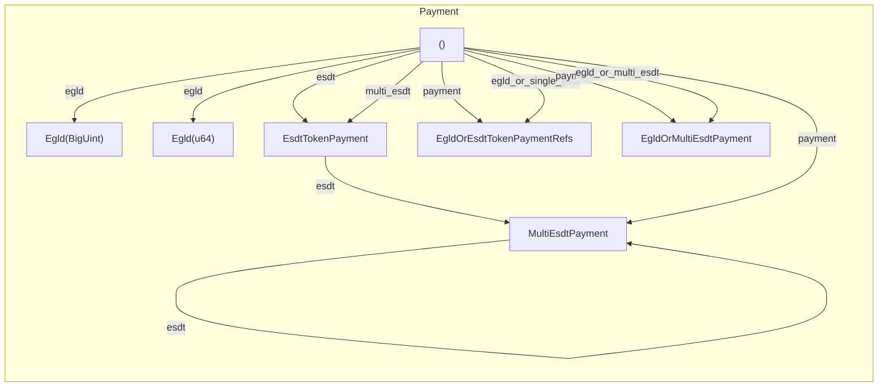

[comment]: # (mx-abstract)

- `.payment(...)` syntax, accepts all legal types

[comment]: # (mx-context-auto)

## Diagram

The payment is a little more complex than the previous fields. The `.payment(...)` method is suffcient to set any kind of acceptable payment object. However, we have several more functions to help setup the payment field:

[comment]: # (mx-context-auto)

## No payments

- nothing added
- makes sense for contract calls

[comment]: # (mx-context-auto)

## EGLD payment

- `.egld(value)`
- `Egld(...)` wrapper
- `EgldValue` trait:
    - BigUint
    - u64
    - ...

[comment]: # (mx-context-auto)

## General ESDT payment

- `.esdt(...)`

[comment]: # (mx-context-auto)

## Single ESDT payment (with references)

[comment]: # (mx-context-auto)

## Normalization

- what it is, builtin function calls
- performed automatically
