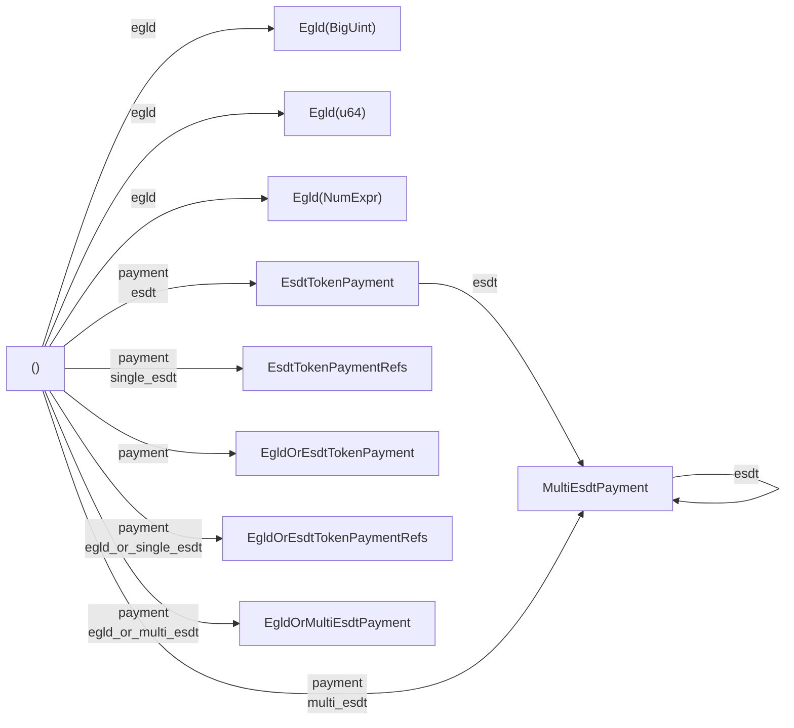
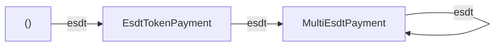

[comment]: # (mx-abstract)

## Overview

Payments can be easily attached to the transaction with the new syntax through the `Payment` generic. In order to specialize the generic, the framework provides the `.payment(...)` method, which accepts all legal types (all types that `can` be payment) such as: `EsdtTokenPayment`, `(TokenIdentifier, u64, BigUint)`, `ManagedVec<EsdtTokenPayment>`, etc. The framework also provides other various helper methods, basically wrappers around `.payment(...)` for accessibility.

[comment]: # (mx-context-auto)

## Diagram

The payment is a little more complex than the previous fields. The `.payment(...)` method is sufficient to set any kind of acceptable payment object. However, we have several more functions to help setup the payment field:



[comment]: # (mx-context-auto)

## No payments

When no payments are added, the `Payment` fields remain of type `()`. This makes sense when dealing with contract or built-in function calls that don't involve payment.

```rust title=contract.rs
    self.tx() // tx with sc environment
        .to(&to)
        .raw_call(endpoint_name) // raw endpoint call
        .sync_call() // synchronous call
```

In this example, the transaction is a smart contract call to a non payable endpoint with no arguments.


[comment]: # (mx-context-auto)

## EGLD payment

We represent EGLD payments with the wrapper type `Egld`. This wrapper makes sure that there is no ambiguity as to what the given amount represents.

The `Egld` contains a single field, holding the amount. This amount will eventually be resolved as a `BigUint`, but the developer can also provide other types, if convenient, such as `u64`, `i32`, or `NumExpr`. In general, any type that implements trait `EgldValue` can be used.

EGLD payments can be specified using `.payment(Egld(amount))`, but for brevity it is common to use method `.egld(amount)`, which does the same.

:::caution
The amounts are expressed in indivisible atto-EGLD (10^-18) units. You must always take the denomination into account.
:::

Some examples of specifying EGLD payments:

[comment]: # (mx-context-auto)

### `BigUint`

The most straightforward type to encode amounts.

```rust title=contract.rs
    #[endpoint]
    #[payable("EGLD")]
    fn send_egld(
        &self,
        to: ManagedAddress,
        egld_amount: BigUint
    ) {
        self
            .tx() // tx with sc environment
            .to(to)
            .egld(egld_amount) // BigUint value
            .transfer()
    }
```

[comment]: # (mx-context-auto)

### `&BigUint` , `ManagedRef<BigUint>`


References are also allowed. A slightly less common variation is the `ManagedRef` type, which is used in certain places of the framework. It is semantically equivalent to a readonly reference (`&...`). You can see it in this example:

```rust title=contract.rs
    #[endpoint]
    #[payable("EGLD")]
    fn forward_egld(
        &self,
        to: ManagedAddress,
        endpoint_name: ManagedBuffer,
        args: MultiValueEncoded<ManagedBuffer>,
    ) {
        let payment = self.call_value().egld_value(); // readonly BigUint managed reference
        self
            .tx() // tx with sc environment
            .to(to)
            .egld(payment) // BigUint value
            .raw_call(endpoint_name) // endpoint call
            .argument(&args)
            .sync_call()
    }
```

[comment]: # (mx-context-auto)

### `u64`

In tests it might be unwieldy to keep creating `BigUint` instances, and the amounts might not be so large, so it can be more comfortable to work with `u64` values.

```rust title=blackbox_test.rs
    const STAKE_AMOUNT: u64 = 20;
    self.world
        .tx() // tx with test exec environment
        .from(&address.to_address())
        .to(PRICE_AGGREGATOR_ADDRESS)
        .typed(price_aggregator_proxy::PriceAggregatorProxy) // typed call
        .stake() // endpoint call
        .egld(STAKE_AMOUNT) // u64 value
        .run();
```

[comment]: # (mx-context-auto)

### `NumExpr`

This type helps us control how the values will be exported in the mandos trace. Its contents will be a numeric mandos expression. Use if you are insterested in a readable mandos output.

Alternatively, it can visually convey certain information, in this case the mandos separators are (mis-)used to indicate the EGLD decimals.

```rust title=interact.rs
    self.interactor
        .tx() // tx with interactor exec environment
        .from(&self.wallet_address)
        .to(self.state.current_adder_address())
        .egld(NumExpr("0,050000000000000000")) // 0,05 EGLD => 5 * 10^16
        .prepare_async()
        .run()
        .await;
```

In this example, the value put inside `NumExpr` is equal to 0,05 EGLD. The `0,` component is just stylistic and can be ignored, and there are 16 digits after `5` from a total of 18, marking the decimal point.

[comment]: # (mx-context-auto)

### `i32`

`i32` is only supported because it is the default Rust numeric type and unannotated numeric constants are of this type.

Make sure you don't pass a negative value!

```rust title=blackbox_test.rs
    state
        .world
        .tx() // tx with test exec environment
        .from(FIRST_USER_ADDRESS)
        .to(CROWDFUNDING_ADDRESS)
        .typed(crowdfunding_esdt_proxy::CrowdfundingProxy)
        .fund()
        .egld(1000) // i32 value
        .with_result(ExpectError(4, "wrong token"))
        .run();
```


[comment]: # (mx-context-auto)

## General ESDT payment

Any ESDT payment can be easily attached to a transaction through the `.esdt(...)` method. This method accepts as argument any type that can be converted into an `EsdtTokenPayment` and can be called multiple times on the same call.




```rust title=contract.rs
self.tx() // tx with sc environment
    .to(caller)
    .esdt((esdt_token_id.clone(), nonce, amount.clone())) // a tuple with three values
    .esdt(EsdtTokenPayment::new(esdt_token_id, nonce, amount)) // an EsdtTokenPayment
    .transfer();
```

In this example, calling `.esdt(...)` will attach an ESDT payment load to the transaction. When adding subsequent `.esdt(...)` calls, the payload automatically converts into a `multi payment`.


[comment]: # (mx-context-auto)

## Single ESDT payment with references

Sometimes we don't have ownership of the token identifier object, or amount, and we would like to avoid unnecessary clones. For this reason, we hava created the `EsdtTokenPaymentRefs`, which contains references and can be used as the payment object.

For brevity, instead of `payment(EsdtTokenPaymentRefs::new(&token_identifier, token_nonce, &amount))`, we can use `.single_esdt(&token_identifier, token_nonce, &amount)`.

```rust title=contract.rs
    #[payable("*")]
    #[endpoint]
    fn send_esdt(&self, to: ManagedAddress) {
        let (token_id, payment) = self.call_value().single_fungible_esdt();
        let half = payment / BigUint::from(2u64);

        self.tx()
            .to(&to)
            .single_esdt(&token_id, 0, &half)
            .transfer();

        self.tx()
            .to(&self.blockchain().get_caller())
            .single_esdt(&token_id, 0, &half)
            .transfer();
    }
```

In this case, adding the ESDT token as payment through `.single_esdt(...)` gives the developer the possibility to keep using the referenced values afterwards without cloning.


[comment]: # (mx-context-auto)

## Multi ESDT payment

The framework defines the alias `type MultiEsdtPayment<Api> = ManagedVec<Api, EsdtTokenPayment<Api>>;`, which is how multi-esdt payments are held in memory. If we have an object of this type, we can pass it directly as payment.

```rust
let tokens_to_claim = MultiEsdtPayment::<Self::Api>::new(); // multiple tokens
self.tx().to(&caller).payment(tokens_to_claim).transfer(); // multi token payment
```

It is also possible to pass a reference or `ManagedRef<MultiEsdtPayment>` as payment, e.g.:

```rust
// type annotation added for clarity, normally inferred
let payments: ManagedRef<'static, MultiEsdtPayment<Self::Api>> = self.call_value().all_esdt_transfers();
self.tx().to(&caller).payments(payments).transfer();
```

The input type is enough for the `payment` method. We also have `.multi_esdt(...)`, which does the same as `payment`, but will additionally convert the argument to `MultiEsdtPayment`. For instance, sending an `EsdtTokenPayment` to `multi_esdt` will set the payment to `MultiEsdtPayment` instead of `EsdtTokenPayment`.

It is also possible to construct a `MultiEsdtPayment`  by calling `.esdt(...)` at least twice, as seen [earlier](#general-esdt-payment).


[comment]: # (mx-context-auto)

## Mixed transfers

Sometimes we don't know at compile time what kind of transfers we are going to perform. For this reason, we also provide contract call types that work with both EGLD and ESDT tokens. 

[comment]: # (mx-context-auto)

### EGLD or single ESDT

`EgldOrEsdtTokenPayment` allows us to decide at runtime for either EGLD or single ESDT payments. The object can be used as payment.

```rust
// type annotation added for clarity, normally inferred
let payment: EgldOrEsdtTokenPayment<Self::Api> = self.call_value().egld_or_single_esdt();
self.tx().to(to).payment(payment).transfer();
```

[comment]: # (mx-context-auto)

### EGLD or single ESDT references

We also have the type `EgldOrEsdtTokenPaymentRefs`, which contains references to the token identifier and amount. 

For brevity, instead of `payment(EgldOrEsdtTokenPaymentRefs::new(&egld_or_esdt_token_identifier, token_nonce, &amount))`, we can use `.single_esdt(&egld_or_esdt_token_identifier, token_nonce, &amount)`.


[comment]: # (mx-context-auto)

### EGLD or multi-ESDT

`EgldOrMultiEsdtPayment` allows us to decide at runtime for either EGLD or multiple ESDT payments. The object can be used as payment.

```rust
// type annotation added for clarity, normally inferred
let payments: EgldOrMultiEsdtPayment<Self::Api> = self.call_value().any_payment();
self.tx().to(to).payment(payment).transfer();
```

[comment]: # (mx-context-auto)

## Normalization

We call normalization the logic of converting transactions with an ESDT payments fields into ESDT built-in function calls. Depending on the type of payment, the generated call be to either one of:
- ESDTTransfer,
- ESDTNFTTransfer,
- MultiESDTNFTTransfer.

For ESDTNFTTransfer and MultiESDTNFTTransfer, the recipient field also needs to be changed into the sender, and the real recipient added to the arguments.

This operation is done automatically by the framework before sending transactions, so the developer should normally not worry about it.
