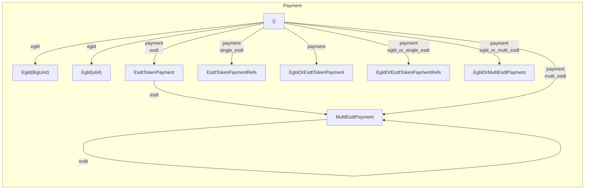

[comment]: # (mx-abstract)

## Overview

Payments can be easily attached to the transaction with the new syntax through the `Payment` generic. In order to specialize the generic, the framework provides the `.payment(...)` method, which accepts all legal types (all types that `can` be payment) such as: `EsdtTokenPayment`, `(TokenIdentifier, u64, BigUint)`, `ManagedVec<EsdtTokenPayment>`, etc. The framework also provides other various helper methods, basically wrappers around `.payment(...)` for accessibility.

[comment]: # (mx-context-auto)

## Diagram

The payment is a little more complex than the previous fields. The `.payment(...)` method is suffcient to set any kind of acceptable payment object. However, we have several more functions to help setup the payment field:



[comment]: # (mx-context-auto)

## No payments

When no payments are added, the `Payment` generic becomes `()`. These types of transactions make sense when dealing with contract calls that don't necessarily require payment.

```rust title=contract.rs
    self.tx() // tx with sc environment
        .to(&to)
        .raw_call(endpoint_name) // raw endpoint call
        .sync_call() // synchronous call
```

In this example, the transaction is a smart contract call to a non payable endpoint with no arguments.

[comment]: # (mx-context-auto)

## EGLD payment

Attaching an `EGLD` payment can be done through the `.egld(...)` method. The structure responsible for this is `Egld<EgldValue>(pub EgldValue)`, which is a tuple struct. Essentially, the `Egld` struct is a simple wrapper around a single value of type `EgldValue`. Through the `EgldValue` trait, the developer can place any kind of value that can be interpreted as a positive number.

There are several `EgldValue` specialization options provided by the framework:
- `BigUint` 

```rust title=contract.rs
    #[endpoint]
    #[payable("EGLD")]
    fn call_endpoint(
        &self,
        to: ManagedAddress,
        endpoint_name: ManagedBuffer,
        args: MultiValueEncoded<ManagedBuffer>,
    ) {
        let payment = self.call_value().egld_value().clone_value(); // BigUint value
        self
            .tx() // tx with sc environment
            .to(to)
            .egld(payment) // BigUint value
            .raw_call(endpoint_name) // endpoint call
            .argument(&args)
            .sync_call()
    }
```

- `u64`

```rust title=blackbox_test.rs
    const STAKE_AMOUNT: u64 = 20;
    self.world
        .tx() // tx with test exec environment
        .from(&address.to_address())
        .to(PRICE_AGGREGATOR_ADDRESS)
        .typed(price_aggregator_proxy::PriceAggregatorProxy) // typed call
        .stake() // endpoint call
        .egld(STAKE_AMOUNT) // u64 value
        .run();
```

- `NumExpr`

```rust title=interact.rs
    self.interactor
        .tx() // tx with interactor exec environment
        .from(&self.wallet_address)
        .to(self.state.current_adder_address())
        .egld(NumExpr("0,050000000000000000")) // 0,05 EGLD => 5 * 10^16
        .prepare_async()
        .run()
        .await;
```

The `NumExpr` type gives the developer the freedom to write big numbers as strings with separators and does the conversion automatically. In this example, the value put inside `NumExpr` is equal to 0,05 EGLD. The `0,` component is just stylistic and can be ignored, and there are 16 digits after `5` from a total of 18, marking the decimal point.

- `i32`

```rust title=blackbox_test.rs
    state
        .world
        .tx() // tx with test exec environment
        .from(FIRST_USER_ADDRESS)
        .to(CROWDFUNDING_ADDRESS)
        .typed(crowdfunding_esdt_proxy::CrowdfundingProxy)
        .fund()
        .egld(1000) // i32 value
        .with_result(ExpectError(4, "wrong token"))
        .run();
```

[comment]: # (mx-context-auto)

## General ESDT payment

Any ESDT payment can be easily attached to a transaction through the `.esdt(...)` method. This method accepts as argument any type that can be converted into an `EsdtTokenPayment` and can be called multiple times on the same call.

```rust title=contract.rs
self.tx() // tx with sc environment
    .to(caller)
    .esdt((esdt_token_id.clone(), nonce, amount.clone())) // a tuple with three values
    .esdt(EsdtTokenPayment::new(esdt_token_id, nonce, amount)) // an EsdtTokenPayment
    .transfer();
```

In this example, calling `.esdt(...)` will attach an ESDT payment load to the transaction. When adding subsequent `.esdt(...)` calls, the payload automatically converts into a `multi payment`.

[comment]: # (mx-context-auto)

## Multi ESDT payment

In order to use a multi ESDT payment, we can either: compose the multi token through subsequent `.esdt(...)` calls, or use `.multi_esdt(...)` with the payments object as parameter.

```rust title=contract.rs
let tokens_to_claim = ManagedVec::<Self::Api, EsdtTokenPayment<Self::Api>>::new(); // multiple tokens
self.tx().to(&caller).multi_esdt(tokens_to_claim).transfer(); // multi token payment
```

In this case, using `.multi_esdt(...)` helps us create a multi payment payload for the transaction directly.

[comment]: # (mx-context-auto)

## Single ESDT payment (with references)

For accessibility, the framework provides a possibility to pass a single ESDT payment as reference, in order to avoid clones for subsequent token sends, using the method `.single_esdt(...)`.

```rust title=contract.rs
    #[payable("*")]
    #[endpoint]
    fn send_esdt(&self, to: ManagedAddress) {
        let (token_id, payment) = self.call_value().single_fungible_esdt();
        let half = payment / BigUint::from(2u64);

        self.tx()
            .to(&to)
            .single_esdt(&token_id, 0, &half)
            .transfer();

        self.tx()
            .to(&self.blockchain().get_caller())
            .single_esdt(&token_id, 0, &half)
            .transfer();
    }
```

In this case, adding the ESDT token as payment through `.single_esdt(...)` gives the developer the possibility to keep using the referenced values afterwards without cloning.

[comment]: # (mx-context-auto)

## Mixed transfers

Sometimes we don't know at compile time what kind of transfers we are going to perform. For this reason, we also provide contract call types that work with both EGLD and ESDT tokens. 

On MultiversX, we can identify two types of mixed transfers:
- EGLD and a single ESDT payload - can be attached to the transaction using `.egld_or_single_esdt(...)` and the object's reference.

```rust title=contract.rs
    self.tx()
        .to(caller)
        .egld_or_single_esdt(&staking_token, 0, &unstake_amount)
        .transfer();
```
- EGLD and a multi ESDT payload - can be attached to the transaction using `.payment(...)` directly, and placing the full object as a parameter.

```rust title=contract.rs
let multi_tokens = 
        MultiValueEncoded::<Self::Api, EgldOrEsdtTokenPayment<Self::Api>>::new();
let egld_token = 
        EgldOrEsdtTokenPayment::new(EgldOrEsdtTokenIdentifier::egld(), 0u64, amount);

multi_tokens.push(egld_token); // merging both tokens into one vec

self.tx().to(&caller).payment(&multi_tokens).transfer(); // send everything as one
```

[comment]: # (mx-context-auto)

## Normalization

- what it is, builtin function calls
- performed automatically
