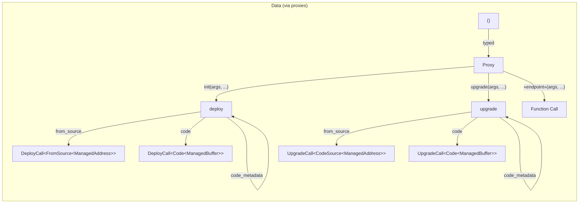

[comment]: # (mx-abstract)

- introducing ...... badum-ts

[comment]: # (mx-context-auto)

## Rationale

- why generate them like, in the first place, advantages
    - easy to import
    - breaking dependencies

[comment]: # (mx-context-auto)

## How to generate

- sc-meta all proxy

[comment]: # (mx-context-auto)

## How to set up project to re-generate easily

- sc-config.toml

[comment]: # (mx-context-auto)

## Adjusting types

- type_abi
- if your type is in a private module of another crate .... replace!

## Diagram

This is the diagram for how to populate the data field using proxies. For the raw setup, see [here](tx-data#diagram)

## Original type ... anticipating RH

- proxies also specify return type

## NotPayable protection

... against accidental payments

## Payment arguments not yet supported

SoonTM

[comment]: # (mx-context-auto)

## Old vs. new

[comment]: # (mx-context-auto)

## Implementation details

- you will not need this!
