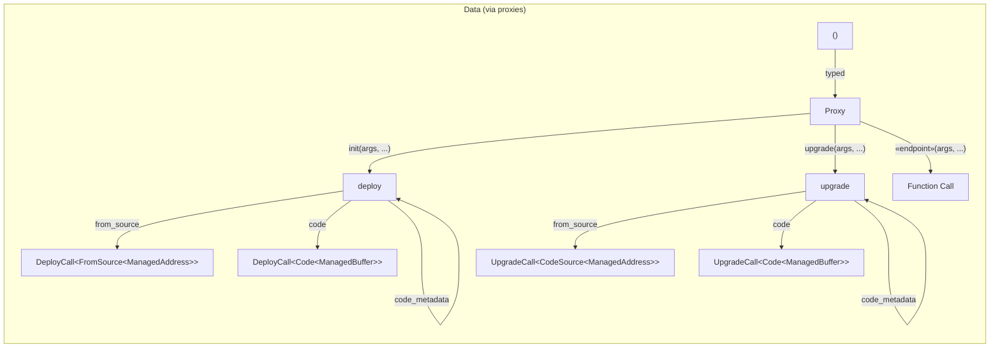

[comment]: # (mx-abstract)

## Overview

Proxies are objects that mimic the contract, they provide methods with the same names and the same argument types. When called, they will format a transaction for the contract. So they act as translators: you can call them just like regular functions, and they will translate it for the blockchain and pass on the call. They also tell you what type the function is expected to return.

New proxies are generated as structures. If you have the proxy, you have all its methods. The generated code is in plain sight and readable, designed to add no overhead to the contract binaries once compiled.

Proxies can be simply copied between crates, so there is no more need for dependencies between contract crates. Proxies do not mind what their source contract code looks like or what framework version it uses.

[comment]: # (mx-context-auto)

## How to generate

Proxy generation can be triggered by calling `sc-meta all proxy` in the contract root folder. This command generates the proxy of the contract in `/output` folder with name `proxy.rs` if it has no configuration. To configure it, you need to modify sc-config.toml.

This first image represents the structure of the project without calling a proxy generator, while the second one shows how it is called and what files it generates.


[comment]: # (mx-context-auto)

## How to set up project to re-generate easily

In order to configure the proxy, you need to change sc-config.toml. If this file is absent from the project directory, you have to create it.

### Path

To use a proxy, specify the output path where the generated proxy file will be saved. This ensures that whenever you regenerate the proxy, the configured path will be automatically updated with the latest version.

```
[settings]

[[proxy]]
path = "src/adder_proxy.rs"
```

After the proxy is generated via "sc-meta all proxy" command, you have to import the module in the contract.

```rust title=adder.rs
#![no_std]

use multiversx_sc::imports::*;

pub mod adder_proxy;

#[multiversx_sc::contract]
pub trait Adder {
    ...
}
```
:::note
Changing the settings requires configuring the output path.
:::
### Override imports
If you need to override the proxy imports that are encapsulated in the line `use multiversx_sc::proxy_imports::*;` from proxy, you can achieve this by adding the `override_import`.


```
[settings]

[[proxy]]
path = "src/adder_proxy.rs"
override-import = "use multiversx_sc::abi::{ContractAbi, EndpointAbi};"
```

### Rename paths
If you want to rename paths from structures and enumerations in a generated proxy, use the `path-rename` setting. Specify both the original path and the new name you want.

```
[[proxy]]
path = "../kitty-ownership/src/kitty_genetic_alg_proxy.rs"
[[proxy.path-rename]]
from = "kitty::kitty"
to = "kitty"
```

### Generate variant from multi-contract
To generate a proxy for a specific variant within a multi-contract project, use the `variant` setting and specify the desired variant.

```
[settings]
main = "multi-contract-main"

[[proxy]]
variant = "multi_contract_example_feature"
path = "src/multi_contract_example_feature_proxy.rs"
```


[comment]: # (mx-context-auto)

## Adjustments in contracts

Before generating a proxy, you have to change every structure and enumeration that contains `#[derive(TypeAbi)]` with `#[type_abi]`. If you do not update structures and enumerations, they will not be correctly generated in the proxy.

Before version 0.49.0:
```rust title=lib.rs
#[derive(TopEncode, TopDecode, PartialEq, Eq, Clone, Copy, Debug, TypeAbi)]
pub enum Status {
    FundingPeriod,
    Successful,
    Failed,
}
```
After version 0.49.0:
```rust title=lib.rs
#[type_abi]
#[derive(TopEncode, TopDecode, PartialEq, Eq, Clone, Copy, Debug)]
pub enum Status {
    FundingPeriod,
    Successful,
    Failed,
}
```
If the custom type is in a private module or another crate is better to replace it because the proxy will be useless.


## Diagram

This is the diagram for how to populate the data field using proxies. For the raw setup, see [here](tx-data#diagram)




Proxies additionally capture the return type originally defined within the smart contract.

All non-payment endpoints in the generated proxy have a safeguard to prevent accidental payments. This involves automatically setting the payment to **NotPayable**.

## Payment arguments not yet supported

SoonTM

[comment]: # (mx-context-auto)

## Old vs. new

[comment]: # (mx-context-auto)

## Implementation details

- you will not need this!
