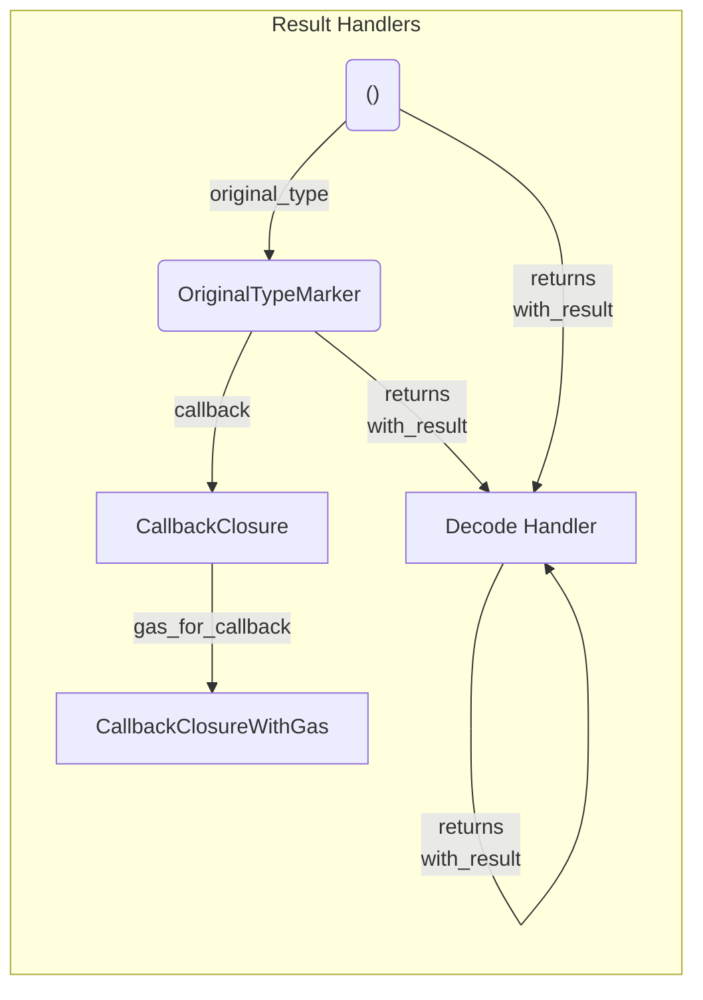

[comment]: # (mx-abstract)

intro


[comment]: # (mx-context-auto)

## Diagram




[comment]: # (mx-context-auto)

## No result handlers

- transfer execute (duh)

[comment]: # (mx-context-auto)

## Asynchronou callbacks


[comment]: # (mx-context-auto)

## Result decoders

Result decoders come in handy when defining exact return types from smart contract endpoints. Being part of the unified syntax, they are consistent through the various environments (smart contract, interact, test) and can be used in combination with each other as long as it makes sense for the specific transaction. 

::::note
When multiple result decoders are used in a transaction, a tuple with all the result types from each decoder will be returned.
::::

There are various predefined types of result decoders:
- `ReturnsRawResult`
    - returns `ManagedVec<Env::Api, ManagedBuffer<Env::Api>>`, representing the raw data result from the call.

```rust title=contract.rs
#[endpoint]
fn deploy_contract(
    &self,
    code: ManagedBuffer,
    code_metadata: CodeMetadata,
    args: MultiValueEncoded<ManagedBuffer>,
) -> ManagedVec<Self::Api, ManagedBuffer> {
    self.tx()
        .raw_deploy()
        .code(code)
        .code_metadata(code_metadata)
        .arguments_raw(args.to_arg_buffer())
        .returns(ReturnsRawResult)
        .sync_call()
        .into()
}
```

- `ReturnsResult`
    - returns the original type from the function signature. The exact original type is extracted from the return type of the corresponding function from the proxy.

```rust title=interact.rs
async fn quorum_reached(&mut self, action_id: usize) -> bool {
    self.interactor
        .query()
        .to(self.state.current_multisig_address())
        .typed(multisig_proxy::MultisigProxy)
        .quorum_reached(action_id)
        .returns(ReturnsResult) // knows from the proxy that the expected return type is bool
        .prepare_async()
        .run()
        .await
}
```

- `ReturnsResultUnmanaged`
    - especially useful in interactor environments, returns the original result type from the function signature (similar to `ReturnsResult`). However, `ReturnsResultUnmanaged` converts the original result type into an unmanaged type, for better accessibility outside the smart contract environment.

```rust title=interact.rs
async fn get_sum(&mut self) -> num_bigint::BigUint {
    self
        .interactor
        .query()
        .to(self.state.current_adder_address())
        .typed(adder_proxy::AdderProxy)
        .sum() // original return type is multiversx_sc::types::BigUint 
        .returns(ReturnsResultUnmanaged) // converts into num_bigint::BigUint
        .prepare_async()
        .run()
        .await
}
``` 
In this case, the original return type of the endpoint `sum` is `multiversx_sc::types::BigUint` which is a managed type. `ReturnsResultUnmanaged` automatically converts this type into `num_bigint::BigUint`, a much more accessible type for the interactor, where we want to avoid constantly having to specify the API.

- `ReturnsStatus`
    - especially useful in the testing and interactor environments, returns the transaction status as u64.

```rust title=blackbox_test.rs
#[test]
fn status_test() {
    let mut world = setup();

    let status = world
        .tx()
        .from(OWNER_ADDRESS)
        .to(SC_ADDRESS)
        .typed(proxy::ContractProxy)
        .some_endpoint()
        .returns(ReturnsStatus)
        .run();

    assert_eq!(status, 4); // status 4 - user error
}
```

- `ReturnsMessage`
    - especially useful in the testing and interactor environments, returns the transaction message as String.

```rust title=blackbox_test.rs
#[test]
fn status_and_message_test() {
    let mut world = setup();

    let (status, message) = world
        .tx()
        .from(OWNER_ADDRESS)
        .to(SC_ADDRESS)
        .typed(proxy::ContractProxy)
        .some_endpoint()
        .returns(ReturnsStatus)
        .returns(ReturnsMessage)
        .run();

    assert_eq!(status, 4); // status 4 - user error
    assert_eq!(message, "test"); // error message - test
}
```

- `ReturnsNewBech32Address`
    - used in the testing and interactor environments, returns the newly deployed address after a deploy and converts it to `Bech32Address`.

```rust title=interact.rs
async fn deploy(&mut self) -> Bech32Address {
    self
        .interactor
        .tx()
        .from(&self.wallet_address)
        .typed(adder_proxy::AdderProxy)
        .init(0u32) // deploys adder contract
        .code(&self.adder_code)
        .returns(ReturnsNewBech32Address) // returns newly deployed address as Bech32Address
        .prepare_async()
        .run()
        .await
}
```

- `ReturnsNewManagedAddress`
    - used in the smart contract environment, returns the newly deployed address after a deploy and converts it to `ManagedAddress`.

```rust title=contract.rs
#[endpoint]
fn deploy_from_source(
    &self,
    source_contract_address: ManagedAddress,
    args: MultiValueEncoded<ManagedBuffer>,
) -> ManagedAddress {
    self.tx()
        .raw_deploy() // creates a deploy transaction
        .from_source(source_contract_address)
        .arguments_raw(args.to_arg_buffer())
        .returns(ReturnsNewManagedAddress) // returns newly deployed address as ManagedAddress
        .sync_call()
}
```

- `ReturnsNewAddress`
    - used in the smart contract environment, returns the newly deployed address after a deploy and converts it to `multiversx_sc::types::heap::Address`.

```rust title=blackbox_test.rs
#[test]
fn returns_address_test() {
    let mut world = ScenarioWorld::new();

    let new_address = world
        .tx()
        .from(OWNER_ADDRESS)
        .typed(scenario_tester_proxy::ScenarioTesterProxy)
        .init(5u32) // deploys contract
        .code(CODE_PATH)
        .returns(ReturnsNewAddress) // returns newly deployed address as Address
        .run();

    assert_eq!(new_address, SC_TEST_ADDRESS.to_address());
}
```

- `ReturnsNewTokenIdentifier`
    - used in interactor and testing environments, returns newly issued token identifier as String.

```rust title=interact.rs
async fn issue_token(action_id: usize) -> String {
    self.interactor
        .tx()
        .from(&self.wallet_address)
        .to(self.state.current_multisig_address())
        .gas(NumExpr("80,000,000"))
        .typed(multisig_proxy::MultisigProxy)
        .perform_action_endpoint(action_id) // endpoint that issues token
        .returns(ReturnsNewTokenIdentifier) // newly issued token identifier returned as String
        .prepare_async()
        .run()
        .await
}
```

- `ReturnsBackTransfers`
    - especially useful in the smart contract environment, returns the back-transfers of the call.

```rust title=contract.rs
#[endpoint]
fn forward_sync_retrieve_funds_bt(
    &self,
    to: ManagedAddress,
    token: EgldOrEsdtTokenIdentifier,
    token_nonce: u64,
    amount: BigUint,
) {
    let back_transfers = self
        .tx()
        .to(&to)
        .typed(vault_proxy::VaultProxy)
        .retrieve_funds(token, token_nonce, amount)
        .returns(ReturnsBackTransfers)
        .sync_call();

    require!(
        back_transfers.esdt_payments.len() == 1 || back_transfers.total_egld_amount != 0,
        "Only one ESDT payment expected"
    );
}
```


[comment]: # (mx-context-auto)

## Implementation details - Andrei M.

might be a blog post
