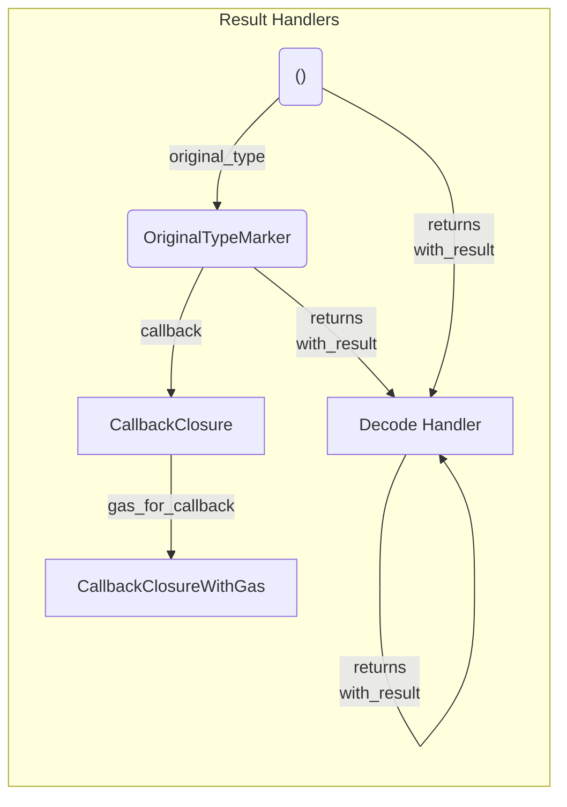

[comment]: # (mx-abstract)

Most of the transaction fields are inputs, or work like inputs. The last one of the fields is the one that deals with the outputs.

There are 3 types of transactions where it comes to outputs:
1. Transactions where we never receive a result, such as those sent via _transfer-execute_. Result handlers are not needed here, in fact they are inappropriate.
2. Transactions that must finalize before we can move on. Here, various results might be returned, and we can decode them on the spot. Result handlers will determine what gets decoded and how.
3. Transactions that will finalize at an unknown time in the future, such as cross-shard calls from contracts. Here, the result handler is the callback that we register, to be executed as soon as the VM receives the response from that transaction iand passes it on to our code.

We've had callbacks for a long time, whereas decoders are new. A transaction can have either one, or the other, not both.

We are going to go focus on their usage, and at the end also try to explain how they work.


[comment]: # (mx-context-auto)

## Diagram

The result handler diagram is split into two: the callback side, and the decoder side.

The decoders are considerably more complex, here we have a simplified version.




[comment]: # (mx-context-auto)

## No result handlers

A transaction might have no result handlers attached to it, if:
- The transaction does not return any result data, such as the case for _transfer-execute_ or simple _transfer_ transactions.
- The transaction could return some results, but we are not interested in them.
    - If no result handlers are specified, no decoding takes place.
    - This is similar to using the `IgnoreValue` return type in the legacy contract call syntax.


[comment]: # (mx-context-auto)

## Original result marker

Type safety is not only important for inputs, but also for outputs. The first step is sigalling what the intended result type is in the original contract, where the endpoint is defined.

Proxies define this type themselves, since they have access to the ABI.

If set, the marker will be visible in the transaction type, as an `OriginalResultMarker<T>` result handler.

:::info
The `OriginalResultMarker` does not do anything by itself, it is a zero-size type, with no methods implemented.

Having only this marker set is no different from having no result handlers specified. It is only a compile-time artifact for ensuring type safety for outputs.
:::

Even when we are providing raw data to a transaction, without proxies, we are allowed to specify the original intended result type outselves. We do this by calling `.original_result()`, with no arguments. If the type cannot be inferred, we need to specify it explicitly, `.original_result::<OriginalType>()`.


[comment]: # (mx-context-auto)

## Default result handler

There is a special case of a default result handler in interactors and in tests.

Without specifying anything, the framework will check that a transaction is successful. This applies to both interactors and tests (in contracts one cannot recover from a failed sync call, so this mechanism is not necessary).

If, however, the developer expects the transaction to fail, this system can easily be overridden by adding an error-related result handler, such as [ExpectError](#expecterror), or [ReturnsStatus](#returnsstatus).


[comment]: # (mx-context-auto)

## Asynchronous callbacks


[comment]: # (mx-context-auto)

## Result decoders

Result decoders come in handy when defining exact return types from smart contract endpoints. Being part of the unified syntax, they are consistent through the various environments (smart contract, interact, test) and can be used in combination with each other as long as it makes sense for the specific transaction.

There are two ways to add a result decoder: via `with_result` or `returns`. 

[comment]: # (mx-context-auto)

### `with_result`

The simpler type of result decoder, it doesn't alter the return type of the transaction run method in any way.

It registers lambdas or similar constructs, which then react to the results as they come.


[comment]: # (mx-context-auto)

### `returns`

Adding a result handler via `result` causes the transaction run function to return various versions of the result, as indicated by the result handler.

For instance, [ReturnsResult](#returnsresult) causes the deserialized result of the transaction to be returned.

If we add multiple result handlers, we will get a tuple with all the requested results.

:::info
The return type is determined at compile time, with no runtime or bytecode size overhead.
:::

In the examples below, the return type is stated explicitly, for clarity. Please note that, because of type inference, they barely ever need to be specified like this.

All examples assume the variable `tx` already has all inputs constructed for it. Let's also assume that the original result type is `MyResult`.

```rust title="No decoder"
let _: () = tx
    .run();
```

The return type here is `()` nothing is deserialized.

```rust title="One decoder"
let r: MyResult = tx
    .returns(ReturnsResult)
    .run();
```

Here, we get the transaction result returned. You might see this in a contract, interactor, or test.

```rust title="Two decoders"
let r: (MyResult, BackTransfers) = tx
    .returns(ReturnsResult)
    .returns(ReturnsBackTransfers)
    .run();
```

This time we want two values out. The framework packs them in a pair, behind the scenes. The order of the values in the tuple is always the same as the order the result handlers were passed. If we pass them in reverse order, we also get the output in reverse order:

```rust title="Same two decoders, reverse order"
let r: (BackTransfers, MyResult) = tx
    .returns(ReturnsBackTransfers)
    .returns(ReturnsResult)
    .run();
```

This mechanism works with any number of result handlers. _(There is a limit of 16 for now, in the unlikely case that anybody will need more, it can easily be increased.)_

```rust title="Three decoders"
let r: (ManagedVec<ManagedBuffer>, ManagedAddress, BackTransfers) = tx
    .returns(ReturnsRawResult)
    .returns(ReturnsNewManagedAddress)
    .returns(ReturnsBackTransfers)
    .run();
```

There is no limitation that the same decoder cannot be used multiple times, although it makes little sense in practice:

```rust title="Duplicate decoders"
let r: (MyResult, MyResult, Address, MyResult) = tx
    .returns(ReturnsResult)
    .returns(ReturnsResult)
    .returns(ReturnsNewAddress)
    .returns(ReturnsResult)
    .run();
```

Methods `returns` and `with_result` can be interspersed in any order. Calls to `with_result` will not affect the return type.

```rust title="returns + with_result"
let r: Address = tx
    .returns(ReturnsAddress)
    .with_result(WithResultRaw(|raw|) assert!(raw.is_empty())) 
    .run();
```

Also adding an example with only `with_result`, something you are likely to see in black-box tests.

```rust title="No return, with_result"
let r: () = tx
    .with_result(ExpectError(4, "sample error")) 
    .run();
```


[comment]: # (mx-context-auto)

## List of result decoders

There are various predefined types of result decoders:


[comment]: # (mx-context-auto)

### `ReturnsRawResult`

Returns: `ManagedVec<Env::Api, ManagedBuffer<Env::Api>>`, representing the raw data result from the call.

```rust title=contract.rs
#[endpoint]
fn deploy_contract(
    &self,
    code: ManagedBuffer,
    code_metadata: CodeMetadata,
    args: MultiValueEncoded<ManagedBuffer>,
) -> ManagedVec<Self::Api, ManagedBuffer> {
    self.tx()
        .raw_deploy()
        .code(code)
        .code_metadata(code_metadata)
        .arguments_raw(args.to_arg_buffer())
        .returns(ReturnsRawResult)
        .sync_call()
        .into()
}
```


[comment]: # (mx-context-auto)

### `ReturnsResult`

Returns: the original type from the function signature. The exact original type is extracted from the return type of the corresponding function from the proxy.

```rust title=interact.rs
async fn quorum_reached(&mut self, action_id: usize) -> bool {
    self.interactor
        .query()
        .to(self.state.current_multisig_address())
        .typed(multisig_proxy::MultisigProxy)
        .quorum_reached(action_id)
        .returns(ReturnsResult) // knows from the original type marker that the expected return type is bool
        .prepare_async()
        .run()
        .await
}
```


[comment]: # (mx-context-auto)

### `ReturnsResultUnmanaged`

Returns: the unmanaged version of the original result type. This relies on the `Unmanaged` associated type in `TypeAbi`. 

For example:

| Managed type          | Unmanaged version                     |
| --------------------- | ------------------------------------- |
| Managed `BigUint`     | Rust `BigUint` (alias: `RustBigUint`) |
| Managed `BigInt`      | Rust `BigInt` (alias: `RustBigInt`)   |
| `ManagedBuffer`       | `Vec<u8>`                             |
| `ManagedAddress`      | `Address`                             |
| `ManagedVec<T>`       | `Vec<T::Unmanaged>`                   |
| `ManagedOption<T>`    | `Option<T::Unmanaged>`                |
| `ManagedByteArray<N>` | `[u8; N]`                             |
| `BigFloat`            | `f64`                                 |

Also, most generic container types (`Option`, `Vec`, etc.) will point to themselves, but with the unmanaged version of their contents. 

For all other types, it returns the original type, same as `ReturnsResult`.

It is especially useful in interactor and test environments, as it allows us to avoid performing additional conversions.

```rust title=interact.rs
async fn get_sum(&mut self) -> RustBigUint {
    self
        .interactor
        .query()
        .to(self.state.current_adder_address())
        .typed(adder_proxy::AdderProxy)
        .sum() // original return type is multiversx_sc::types::BigUint 
        .returns(ReturnsResultUnmanaged) // converts into num_bigint::BigUint
        .prepare_async()
        .run()
        .await
}
```

In this case, the original return type of the endpoint `sum` is `multiversx_sc::types::BigUint` which is a managed type. `ReturnsResultUnmanaged` automatically provides us with `num_bigint::BigUint`, a much more accessible type for the interactor, where we want to avoid constantly having to specify the API.


[comment]: # (mx-context-auto)

### `ReturnsStatus`

Returns: the transaction status as u64.

Especially useful in the testing and interactor environments.

```rust title=blackbox_test.rs
#[test]
fn status_test() {
    let mut world = setup();

    let status = world
        .tx()
        .from(OWNER_ADDRESS)
        .to(SC_ADDRESS)
        .typed(proxy::ContractProxy)
        .some_endpoint()
        .returns(ReturnsStatus)
        .run();

    assert_eq!(status, 4); // status 4 - user error
}
```


[comment]: # (mx-context-auto)

### `ReturnsMessage`

Returns: the transaction error message as String.

Especially useful in the testing and interactor environments, 

```rust title=blackbox_test.rs
#[test]
fn status_and_message_test() {
    let mut world = setup();

    let (status, message) = world
        .tx()
        .from(OWNER_ADDRESS)
        .to(SC_ADDRESS)
        .typed(proxy::ContractProxy)
        .some_endpoint()
        .returns(ReturnsStatus)
        .returns(ReturnsMessage)
        .run();

    assert_eq!(status, 4); // status 4 - user error
    assert_eq!(message, "test"); // error message - test
}
```


[comment]: # (mx-context-auto)

### `ReturnsNewBech32Address`

Returns: the newly deployed address after a deploy, as `Bech32Address`.

Used in the testing and interactor environments.

```rust title=interact.rs
async fn deploy(&mut self) -> Bech32Address {
    self
        .interactor
        .tx()
        .from(&self.wallet_address)
        .typed(adder_proxy::AdderProxy)
        .init(0u32) // deploys adder contract
        .code(&self.adder_code)
        .returns(ReturnsNewBech32Address) // returns newly deployed address as Bech32Address
        .prepare_async()
        .run()
        .await
}
```


[comment]: # (mx-context-auto)

### `ReturnsNewManagedAddress`

Returns: the newly deployed address after a deploy, as `Bech32Address`.

Used in the smart contract environments.

```rust title=contract.rs
#[endpoint]
fn deploy_from_source(
    &self,
    source_contract_address: ManagedAddress,
    args: MultiValueEncoded<ManagedBuffer>,
) -> ManagedAddress {
    self.tx()
        .raw_deploy() // creates a deploy transaction
        .from_source(source_contract_address)
        .arguments_raw(args.to_arg_buffer())
        .returns(ReturnsNewManagedAddress) // returns newly deployed address as ManagedAddress
        .sync_call()
}
```


[comment]: # (mx-context-auto)

### `ReturnsNewAddress`

Returns: the newly deployed address after a deploy, as `multiversx_sc::types::heap::Address`.

```rust title=blackbox_test.rs
#[test]
fn returns_address_test() {
    let mut world = ScenarioWorld::new();

    let new_address = world
        .tx()
        .from(OWNER_ADDRESS)
        .typed(scenario_tester_proxy::ScenarioTesterProxy)
        .init(5u32) // deploys contract
        .code(CODE_PATH)
        .returns(ReturnsNewAddress) // returns newly deployed address as Address
        .run();

    assert_eq!(new_address, SC_TEST_ADDRESS.to_address());
}
```


[comment]: # (mx-context-auto)

### `ReturnsNewTokenIdentifier`

Returns: a newly issued token identifier, as String. It will search for it in logs.

Useable in interactor environments.

```rust title=interact.rs
async fn issue_token(action_id: usize) -> String {
    self.interactor
        .tx()
        .from(&self.wallet_address)
        .to(self.state.current_multisig_address())
        .gas(NumExpr("80,000,000"))
        .typed(multisig_proxy::MultisigProxy)
        .perform_action_endpoint(action_id) // endpoint that issues token
        .returns(ReturnsNewTokenIdentifier) // newly issued token identifier returned as String
        .prepare_async()
        .run()
        .await
}
```


[comment]: # (mx-context-auto)

### `ReturnsBackTransfers`

Returns the back-transfers of the call, as a specialized structure, called `BackTransfers`.

Useable in a smart contract environment.

```rust title=contract.rs
#[endpoint]
fn forward_sync_retrieve_funds_bt(
    &self,
    to: ManagedAddress,
    token: EgldOrEsdtTokenIdentifier,
    token_nonce: u64,
    amount: BigUint,
) {
    let back_transfers = self
        .tx()
        .to(&to)
        .typed(vault_proxy::VaultProxy)
        .retrieve_funds(token, token_nonce, amount)
        .returns(ReturnsBackTransfers)
        .sync_call();

    require!(
        back_transfers.esdt_payments.len() == 1 || back_transfers.total_egld_amount != 0,
        "Only one ESDT payment expected"
    );
}
```


[comment]: # (mx-context-auto)

### `ExpectError`


[comment]: # (mx-context-auto)

## Implementation details - Andrei M.

might be a blog post
