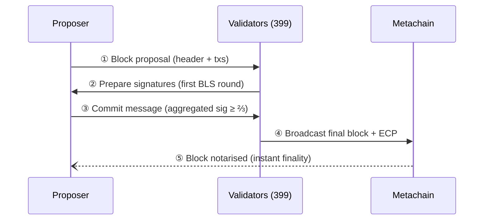

# Consensus (Secure Proof‑of‑Stake – SPoS)

## 1.  How Consensus Works in MultiversX (post-Andromeda)

Consensus is the protocol that keeps every shard and the Metachain in lock‑step, ensuring all honest participants share **one canonical history**. MultiversX uses a bespoke scheme called **Secure Proof‑of‑Stake (SPoS)**, a blend of stake‑weighted validator selection, VRF‑style randomness, and a high‑speed BLS multisignature algorithm that guarantees _single‑block finality_.

Below is a step‑by‑step walk‑through of *one* six‑second block cycle (round `r`). The same engine runs independently in **every execution shard** and in the **Metachain**.

### 1.1  Validator set and epochs

* **Validators.** Nodes that stake a minimum of 2500EGLD and run the MultiversX node client software. Each validator holds a long‑lived BLS key that is rotated only when they unbond/unstake, anyway the keys are shuffled among shards each epoch.
* **Epoch.** A period of 24 hours (≈ 14 400 blocks on a 6 s cadence-round). At the start of every epoch the 400 validators in each shard are reshuffled using a deterministic permutation seeded with verifiable randomness. The composition of a shard remains fixed for the whole epoch.

### 1.2  Round randomness

```
newRandSeed = currentProposer.Sign(lastRandSeed) 
randomness = hash(newRandSeed, currentRound)
```
* `newRandSeed` - VUF (Verifiable Unpredictable Function). It allows the generate seeds that are verifiable, unpredictable but not uniform.
* `randomness` - VRF (Verifiable Random Function)

### 1.3  Proposer election

Each validator hashes together its public key and `rand_r`:

```
score_i = Hash(PK_i ‖ rand_r)
```

The lowest score wins and becomes the **proposer** for round `r`. Ties are astronomically unlikely.

### 1.4  Two‑phase BLS consensus

Once chosen, the proposer assembles a block and broadcasts it to the other 399 validators. Consensus then runs in **two BLS rounds**—`prepare` and `commit`—similar to PBFT but with aggregated signatures:

1. **Prepare.** Validators check the block (state root, signatures, gas limits). If valid they sign its hash and return a 96‑byte BLS share.
2. **Commit.** The proposer (or any validator) aggregates ≥ ⅔ of the shares into a single 96‑byte signature and broadcasts a **commit message**.

Because **all 400 validators** participate (post‑Andromeda), a share threshold of 268 guarantees Byzantine safety.

### 1.5  Equivalent Consensus Proof (ECP)

The final artefact attached to the block header is an **ECP**:

```
ECP = (agg_signature, bitmap_400)
```

* `agg_signature` – aggregated BLS signature from ≥ 268 validators.
* `bitmap_400` – 400‑bit field indicating which keys took part.

Any validator can perform the aggregation; there is no single point of failure. Because the validator set and aggregation order are deterministic inside the epoch, *exactly one* valid ECP can exist for a given block—making equivocation impossible.

### 1.6  Notarisation and finality

* **Execution shards**: A block is **final the moment its ECP is broadcast**. No confirmation block is needed.
* **Metachain**: Collects hashes of all shard blocks plus their ECPs, notarises them in the metablock of the next round, and itself reaches finality via the same BLS protocol.

**Latency:** ~6 s for intra‑shard txs, ~18 s for cross‑shard (three‑block path).

## 2.  Consensus group size: 63 → 400

| Era | Execution‑shard consensus group | Metachain |
|-----|---------------------------------|-----------|
| **Pre‑Andromeda** | 63 of 400 eligible validators, shuffled _every round_ | 400 validators |
| **Andromeda** | **All 400 validators** every round (fixed for the whole epoch) | **Unchanged** (400) |

Using the full validator set removes the need for a confirmation block; a single consensus proves majority acceptance.

## 3.  Consensus flow (post‑Andromeda)



**Equivalent Consensus Proof (ECP)**  
Any validator can aggregate ≥ ⅔ BLS shares into an ECP. Because aggregation order is fixed and the validator set is constant across the epoch, the proof is uniquely determined – _equivocation is impossible_.

## 4.  Confirmation blocks removed

*Pre‑Andromeda*: each execution shard produced a **block** and, one round later, a **confirmation block** to seal it. The Metachain applied the same pattern to eliminate double‑spend risk.  
*Andromeda*: one block is enough; once its ECP is broadcast the block is final, so no confirmation blocks are produced. This halves average time‑to‑finality.

## 5.  Validator rating & selection

* **Rating** still measures historical performance and influences shard assignment probability at the **epoch shuffle** step.  
* Because every validator now participates in every round, rating no longer affects _per‑round_ selection but continues to impact rewards via uptime and signature participation.

## 6.  Security considerations

* **Byzantine tolerance**: With 400 signatures per block the network tolerates up to 133 malicious validators per shard (≈ ⅓).  
* **Rogue‑key protection**: Implemented via KOSK and deterministic aggregation order – enabling fast verification of 400‑party BLS signatures.  
* **Proposer failure**: Because ECP finalisation is permissionless, the network is no longer sensitive to a single proposer going offline.

## TL;DR

* **400/400 validators** now sign every shard block.
* **Equivalent Consensus Proofs (ECP)** replace leader‑only finalisation – _any_ validator can finalise.
* **Confirmation blocks are gone**: a block is final the moment ≥ ⅔ signatures are aggregated.
* Randomness & proposer selection remain **per‑round** and still depend on the previous block hash.
* Validator **rating** and **stake** continue to influence shard assignment and rewards – unchanged.
