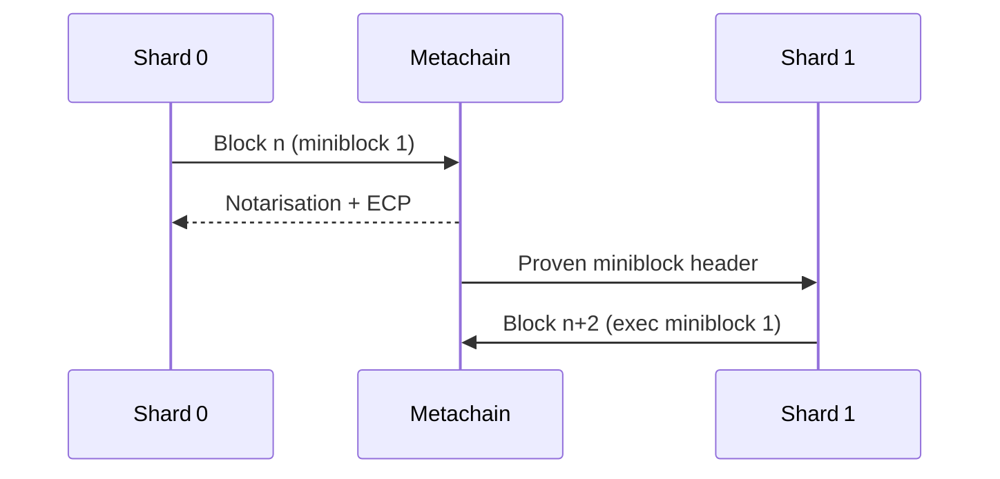

A blockchain transaction is a cryptographically signed instruction sent from one account to another, aiming to update the state of the blockchain network. Each transaction contains details such as the nonce, sender, receiver, amount of value transferred (if it is the case), data, signature (and others). Validators process and verify these transactions, ensuring they are legitimate and adhere to the network's protocol. Once verified, the transaction is recorded in a block and added to the blockchain, making it immutable and transparent.

## **What's a Transaction?**

A MultiversX transaction is an action initiated by an account managed by a user. For example, when Bob sends Alice 1 EGLD, Bob's account is debited and Alice's is credited. This state-changing action occurs within a transaction.

Transactions update the network's state and are broadcast to the entire network. Validators execute and validate these transactions, ensuring they adhere to the network's rules. Each transaction includes details like sender and receiver addresses, the amount of EGLD transferred, and associated fees. These transactions are cryptographically signed to ensure authenticity and security. Transactions require a fee and must be included in a validated block. To make this overview simpler we'll cover [gas fees](/developers/gas-and-fees/overview) and validation elsewhere.

Here’s what a typical MultiversX transaction might include:

- ```Nonce```: A counter indicating the transaction number from the account.
- ```Value```: The amount of EGLD being transferred.
- ```Receiver```: The recipient's address.
- ```Sender```: The sender's address.
- ```Gas Price```: The price paid in EGLD for each gas unit.
- ```Gas Limit```: The maximum gas units the transaction can consume.
- ```Data```: Optional field for additional data.
- ```Chain ID```: The ID of the chain where the transaction has to be processed (Mainnet, Testnet, Sovereign Chain A etc.).
- ```Version```: The version of the transaction type.
- ```Signature```: Generated by the sender’s private key to authorize the transaction.

A ready-to-broadcast transaction is structured as follows:

```json
{
  "nonce": 42,
  "value": "100000000000000000",
  "receiver": "erd1cux02zersde0l7hhklzhywcxk4u9n4py5tdxyx7vrvhnza2r4gmq4vw35r",
  "sender": "erd1ylzm22ngxl2tspgvwm0yth2myr6dx9avtx83zpxpu7rhxw4qltzs9tmjm9",
  "gasPrice": 1000000000,
  "gasLimit": 70000,
  "data": "Zm9vZCBmb3IgY2F0cw==",
  "chainID": "1",
  "version": 1,
  "signature": "5845301de8ca3a8576166fb3b7dd25124868ce54b07eec7022ae3ffd8d4629540dbb7d0ceed9455a259695e2665db614828728d0f9b0fb1cc46c07dd669d2f0e"
}
```

## Cross‑Shard Transactions

### Prerequisites

> **Note**
> To get the most out of this chapter we recommend reading **[Sharding](https://docs.multiversx.com/learn/sharding)** and our **[Introduction to MultiversX](https://docs.multiversx.com/learn/introduction)** first.

### Overview

With the **Andromeda (v1.9.6)** upgrade, cross‑shard execution has been streamlined:

* **Confirmation blocks have been removed** – every shard block is final as soon as it is signed by ≥ 2⁄3 of the 400‑validator consensus group.
* The end‑to‑end path for a cross‑shard transaction is now **three blocks (≈ 18 s on mainnet)**, down from six.
* The underlying data structures – blocks, miniblocks and metablocks – remain unchanged, so no SDK or API schema adjustments are required.

To illustrate the new flow we reduce the network to **two execution shards** (`shard 0`, `shard 1`) and the **Metachain**. A user in `shard 0` sends EGLD to another user in `shard 1`.

### Block structure recap

Each shard block contains:

| Component | Description |
|-----------|-------------|
| **Header** | nonce, round, proposer, timestamp, gas summary, Merkle roots, etc. |
| **Miniblocks** | ordered lists of transactions, grouped by `(sender shard → receiver shard)` pair. |

In `shard 0` a typical block might include three miniblocks:

| Miniblock | Contents |
|-----------|----------|
| **0** | Intra‑shard txs (`shard 0 → shard 0`). |
| **1** | Cross‑shard txs **from `shard 0` to `shard 1`** (our example). |
| **2** | Cross‑shard txs **from `shard 1` to `shard 0`** that were already executed in `shard 1`; they will be finalised here. |

> There is no limit to how many miniblocks with the same sender/receiver pair can appear in one block.

### Processing a cross‑shard transaction (post‑Andromeda)

The atomic unit of cross‑shard execution remains the **miniblock**: either the entire miniblock is processed, or none of its transactions are applied and it is retried in the next round.

MultiversX continues to use an **asynchronous model**:

1. **Validation & execution in the sender’s shard.**  
   `shard 0` fully verifies the transaction (nonce, signatures, balance, etc.) and places it in miniblock 1. The block is produced and immediately final (single‑block finality).
2. **Notarisation by the Metachain.**  
   The Metachain includes the header & miniblock hashes of the new `shard 0` block in metablock `n + 1`, together with an **Equivalent Consensus Proof (ECP)** – a compressed BLS aggregate signature from ≥ 2⁄3 of the validator set.
3. **Execution in the receiver’s shard.**  
   Nodes in `shard 1` read the metablock, fetch miniblock 1 from `shard 0`, verify the ECP, check for replay, and apply the state changes (credit the destination address). The resulting `shard 1` block (nonce `n + 2`) is finalised with its own consensus proof and notarised in the next metablock.

The sequence diagram below highlights the three‑round flow:



#### Rounds required

The transaction is considered **final** once miniblock 1 is executed and notarised in `shard 1`.

| Round | Block location | Event |
|-------|----------------|-------|
| `n` | `shard 0` | Tx validated & executed (miniblock 1). |
| `n + 1` | Metachain | Notarises `shard 0` block (`ECP`). |
| `n + 2` | `shard 1` | Executes & finalises the mirrored miniblock. |

Total latency ≈ 18 seconds on the actual 6 s‑block‑time mainnet.

### Why did cross‑shard execution need six rounds before Andromeda?

Before v1.9.6 a cross‑shard transfer had to survive **at least six separate blocks** to guarantee it could never be reverted elsewhere:

| Step | Round | Chain | Purpose |
|------|-------|-------|---------|
| 1 | `k` | Source shard | Produce block **B<sub>k</sub>** containing the cross‑shard tx. |
| 2 | `k + 1` | Source shard | **Confirmation block** C<sub>k+1</sub> proving B<sub>k</sub>. |
| 3 | `k + 2` | Metachain | Notarise B<sub>k</sub> (only after it sees C<sub>k+1</sub>). |
| 4 | `k + 3` | Metachain | Confirmation metablock M<sub>k+3</sub> proving M<sub>k+2</sub>. |
| 5 | `k + 4` | Destination shard | Execute mirrored miniblock, produce D<sub>k+4</sub>. |
| 6 | `k + 5` | Destination shard | Confirmation block D<sub>k+5</sub>; metachain can now notarise D<sub>k+4</sub>. |

These guard‑rails were essential while only **63 of 400 validators** signed each shard block—an equivocating proposer could, in theory, create conflicting blocks until the confirmation arrived.

With **Andromeda**, every block reaches finality immediately (400 signatures, fixed order), so the two confirmation stages are obsolete and the path collapses to three blocks.

### Cross‑chain proof verification made simpler

| Pre‑Andromeda | Post‑Andromeda |
|---------------|----------------|
| **63 / 400 validators** per block; membership shuffled each round. | **400 / 400 validators** sign every block for the entire epoch. |
| Verifier had to reconstruct the 63‑node subset and their signature order for every proof. | Verifier only needs the epoch‑wide validator list once; proofs are a single aggregated BLS signature. |
| Large metadata overhead in every cross‑chain proof. | Proofs are smaller, easier to verify, cheaper to transmit. |

> **Effect:** Cross‑chain proofs are now lighter and faster to validate while preserving the same security guarantees.

