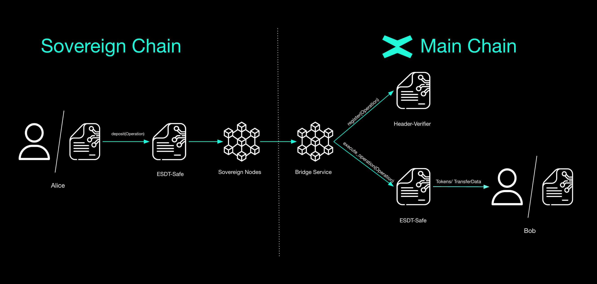

# Execution starting from a Sovereign Chain


For the user — whether an External Owned Account (EOA) like a user wallet or another smart contract — procedure is simple. An address will be able to perform a multi tokens transfer with various types of tokens:
- Fungible Tokens
- (Dynamic) Non-Fungible Tokens
- (Dynamic) Semi-Fungible Tokens
- (Dynamic) Meta ESDT Tokens

When making the deposit, the user specifies:
1. A destination address on the Sovereign Chain
2. `TransferData` if the execution contains a smart contract call, which contains gas, function and arguments

Each action that can be executed remotely through this contract is called an *Operation*. The endpoint responsible for executing those operations is called `execute_operations`.

## Sovereign Chain to Main Chain transfer flow
1. User deposits token to the ESDT-Safe smart contract on Sovereign.
2. Outgoing *Operations* are created at the end of the round.
3. Validators sign all the outgoing *Operations*.
4. Leader sends *Operations* to the bridge service.
5. Bridge service sends the *Operations* to the Header-Verifier for registration and verification, and then to ESDT-Safe for execution.
6. At the end of the execution success/fail, a confirmation event will be added which will be received in sovereign through the observer and then the cross chain transfer will be completed.

## Executing an Operation

```rust
#[endpoint(executeBridgeOps)]
 fn execute_operations(
    &self, 
    hash_of_hashes: ManagedBuffer, 
    operation: Operation<Self::Api>
)
```
- `hash_of_hashes`: hash of all hashes of the operations that were sent in a round
- `operation`: the details of the cross-chain execution

Since this endpoint can be found inside the _From Sovereign_ module, we are safe to say that the cross-chain execution will start from within a Sovereign Chain. The execution flow of this endpoint is at follows:

1. Calculate the hash of the *Operation* received as a parameter.
2. Verify that the given *Operation’s* hash is registered by the Header-Verifier smart contract.
3. Mint tokens or get them from the account.
4. Distribute the tokens.
5. Emit confirmation event or fail event if needed.

As the 2nd point specifies, the [Header-Verifier](#header-verifier-sc) smart contract plays an important role in the cross-chain execution mechanism. In this section there will also be a description for the important endpoints within this contract.

:::note
The source code for the endpoint can be found [here](https://github.com/multiversx/mx-sovereign-sc/blob/main/esdt-safe/src/from_sovereign/transfer_tokens.rs).
:::

### Important structs
```rust
#[derive(TopEncode, TopDecode, NestedEncode, NestedDecode, TypeAbi, ManagedVecItem, Clone)]
pub struct Operation<M: ManagedTypeApi> {
    pub to: ManagedAddress<M>,
    pub tokens: ManagedVec<M, OperationEsdtPayment<M>>,
    pub data: OperationData<M>,
}
```

- `to`: specifies the destination of the *Operation*
- `tokens`: represents one or more token transfers associated with the operation
- `data`: encapsulates additional instructions or parameters that guide the execution of the operation

```rust
pub struct OperationEsdtPayment<M: ManagedTypeApi> {
    pub token_identifier: TokenIdentifier<M>,
    pub token_nonce: u64,
    pub token_data: EsdtTokenData<M>,
}
```

This struct describes a single token transfer action within an *Operation*. Each Operation can have one or more of such payments, with that enabling the transfer of a variety of tokens during a cross-chain transaction. 

- `token_identifier`: used for the identification of the token
- `token_nonce`: if the token is Non-Fungible or Semi-Fungible, it will have a custom nonce, if not the value will be 0
- `token_data`: a structure holding metadata and other token properties

```rust
pub struct OperationData<M: ManagedTypeApi> {
    pub op_nonce: TxId,
    pub op_sender: ManagedAddress<M>,
    pub opt_transfer_data: Option<TransferData<M>>,
}
```

`OperationData` encapsulates the needed information for the *Operation* that needs to be executed. This isn’t just another data definition, we’ve already seen data-related fields elsewhere. Instead, it centralizes the contextual information that *Operation* needs before, during, and after execution.

- `op_nonce`: is used for the identification of each *Operation*
- `op_sender`: represents the original sender of the *Operation*
- `opt_transfer_data`: an optional `TransferData` field, when present, contains details about the cross-chain execution of another Smart Contract

```rust
pub struct TransferData<M: ManagedTypeApi> {
    pub gas_limit: GasLimit,
    pub function: ManagedBuffer<M>,
    pub args: ManagedVec<M, ManagedBuffer<M>>,
}
```

`TransferData` represents the description of the remote execution of another Smart Contract.

- `gas_limit`: specifies the needed gas for the execution of all other endpoints.
- `function`: the name of the endpoint that will be executed.
- `args`: the arguments for the calls.

:::note
The source code for structures can be found [here](https://github.com/multiversx/mx-sovereign-sc/blob/main/common/transaction/src/lib.rs)
:::


## Header-Verifier SC

As mentioned in the [Introduction](cross-chain-execution.md) the Header-Verifier smart contract is responsible to verify signatures, store the *BLS Keys* of the validators and register incoming *Operations*.

### Registering a set of *Operations*
```rust
    #[endpoint(registerBridgeOps)]
    fn register_bridge_operations(
        &self,
        signature: BlsSignature<Self::Api>,
        bridge_operations_hash: ManagedBuffer,
        operations_hashes: MultiValueEncoded<ManagedBuffer>,
    )
```

Any *Operation* before being executed has to be registered in this smart contract. The reason behind this is that the hash will be verified and it will be locked until the operation is executed by the ESDT-Safe contract.

The registering endpoint operates as follows:
1. Verifies that  `bridge_operations_hash` is not found in the `hash_of_hashes_history` storage mapper, otherwise it will return an error.
2. Verifies that the hash of all `operations_hashes` matches the `bridge_operations_hash, otherwise, the endpoint will return an error.
3. All `operations_hashes` are stored in the smart contract's storage with the status OperationsHashStatus::NotLocked.
4. The `bridge_operations_hash` is added to the `hash_of_hashes_history` storage mapper.

```rust
    #[endpoint(lockOperationHash)]
    fn lock_operation_hash(&self, hash_of_hashes: ManagedBuffer, operation_hash: ManagedBuffer)
```

The Header-Verifier has a system in place for locking *Operation* hashes. Locking those registered hashes prevents any unwanted behaviour when executing or removing an *Operation* hash. Remember that the execution of *Operations* can only be done by the ESDT-Safe smart contract. This endpoint when called will follow this flow:

1. Check if the caller is the ESDT-Safe smart contract.
2. Check if the *Operation* is registered.
3. If the hash is not locked set the status in the storage as locked or else return panic.

:::note
The hash can be in two different states: `OperationHashStatus::NotLocked` or `OperationHashStatus::Locked`
:::

```rust
    #[endpoint(removeExecutedHash)]
    fn remove_executed_hash(&self, hash_of_hashes: &ManagedBuffer, operation_hash: &ManagedBuffer)
```

After registering and executing an *Operation* the status of the hash associated to it must be removed from the Header-Verifier's internal storage. This endpoint will be called by the ESDT-Safe smart contract after the execution of the *Operation* is successful. The steps are pretty clear:

1. Check if the caller is the ESDT-Safe smart contract.
2. Remove the status of the hash from storage.

