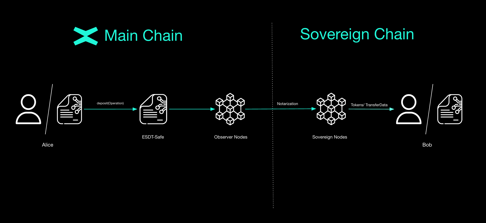

# Mvx-ESDT-Safe


The ability to transfer tokens from the Main Chain to any Sovereign Chain is essential, since every Sovereign can connect to the Main MultiversX Chain. As a result, the customizable Sovereign can leverage any token available on the default network. Another great feature is the possibility of executing smart contracts inside the Sovereign Chain through this contract.

This contract has three main modules: [`deposit`](#deposit), [`execute_operation`](#executing-an-operation) and [`register_token`](#registering-tokens).


## Deposit
### Main Chain deposit to Sovereign Chain transfer flow
1. User deposits the tokens he wishes to transfer in the `Mvx-ESDT-Safe` contract deployed on the Main Chain.
2. An observer is monitoring the Main Chain.
3. Sovereign network receives extended shard header.
4. Incoming transactions processor handles and processes the new transaction.

### Deposit Endpoint
```rust
    #[payable("*")]
    #[endpoint]
    fn deposit(
        &self,
        to: ManagedAddress,
        optional_transfer_data: OptionalValueTransferDataTuple<Self::Api>,
    )
```

One key aspect of cross chain transfers from MultiversX Main Chain to a Sovereign Chain is being able to transfer tokens and also execute a smart contract call within single transaction. The `#[payable("*")]` annotation means that the endpoint can receive any tokens that will transferred. If those tokens are from a Sovereign Chain they will be burned otherwise they will be saved in the Smart Contract`s account. The checks enabled for the transfer of tokens are the following:

- If the token is whitelisted or not blacklisted, in that case the tokens can be transferred.
- If the fee is enabled, the smart contract assures that the fee is paid.
- If there are maximum 10 transfers in the transaction.

If the deposit also includes the `optional_transfer_data` parameter it will also have some extra checks regarding the cross-chain execution of endpoints:

- The gas limit must be under the specified limit.
- The endpoint that has to be executed is not blacklisted.


At the end of the `deposit` endpoint, all the extra tokens will be refunded to the caller and an event will be emitted since the bridging process is complete.


```rust
#[event("deposit")]
fn deposit_event(
    &self,
    #[indexed] dest_address: &ManagedAddress,
    #[indexed] tokens: &MultiValueEncoded<MultiValue3<TokenIdentifier, u64, EsdtTokenData>>,
    event_data: OperationData<Self::Api>,
)
```

This log event will emit the destination address and the tokens which will be transferred to the Sovereign Chain.

:::note
The source code for the endpoint can be found [here](https://github.com/multiversx/mx-sovereign-sc/blob/main/mvx-esdt-safe/src/deposit.rs).
:::

## Executing an Operation

```rust
#[endpoint(executeBridgeOps)]
 fn execute_operations(
    &self, 
    hash_of_hashes: ManagedBuffer, 
    operation: Operation<Self::Api>
)
```
- `hash_of_hashes`: hash of all hashes of the operations that were sent in a round
- `operation`: the details of the cross-chain execution

To ensure that the cross-chain execution is will be successful, the following checks must be passed: 

1. Calculate the hash of the *Operation* received as a parameter.
2. Verify that the given *Operation’s* hash is registered by the Header-Verifier smart contract.
3. Mint tokens or get them from the account.
4. Distribute the tokens.
5. Emit confirmation event or fail event if needed.

As the 2nd point specifies, the `Header-Verifier` smart contract plays an important role in the cross-chain execution mechanism. In the [`Header-Verifier`](header-verifier.md) section there will also be a description for the important endpoints within this contract.

:::note
The source code for the endpoint can be found [here](https://github.com/multiversx/mx-sovereign-sc/blob/main/mvx-esdt-safe/src/execute.rs).
:::

## Important Endpoint Related Structures
This subsection outlines the key data structures that enable robust cross-chain operations. It details how an *Operation* is composed of its destination address, one or more token transfers defined by `OperationEsdtPayment`, and the contextual metadata provided by `OperationData`. Additionally, `TransferData` specifies the parameters needed for executing remote smart contract calls, collectively ensuring precise control over cross-chain interactions.
```rust
#[derive(TopEncode, TopDecode, NestedEncode, NestedDecode, TypeAbi, ManagedVecItem, Clone)]
pub struct Operation<M: ManagedTypeApi> {
    pub to: ManagedAddress<M>,
    pub tokens: ManagedVec<M, OperationEsdtPayment<M>>,
    pub data: OperationData<M>,
}
```

- `to`: specifies the destination of the *Operation*
- `tokens`: represents one or more token transfers associated with the operation
- `data`: encapsulates additional instructions or parameters that guide the execution of the operation

```rust
pub struct OperationEsdtPayment<M: ManagedTypeApi> {
    pub token_identifier: TokenIdentifier<M>,
    pub token_nonce: u64,
    pub token_data: EsdtTokenData<M>,
}
```

This struct describes a single token transfer action within an *Operation*. Each Operation can have one or more of such payments, with that enabling the transfer of a variety of tokens during a cross-chain transaction. 

- `token_identifier`: used for the identification of the token
- `token_nonce`: if the token is Non-Fungible or Semi-Fungible, it will have a custom nonce, if not the value will be 0
- `token_data`: a structure holding metadata and other token properties

```rust
pub struct OperationData<M: ManagedTypeApi> {
    pub op_nonce: TxId,
    pub op_sender: ManagedAddress<M>,
    pub opt_transfer_data: Option<TransferData<M>>,
}
```

`OperationData` encapsulates the needed information for the *Operation* that needs to be executed. This isn’t just another data definition, we’ve already seen data-related fields elsewhere. Instead, it centralizes the contextual information that *Operation* needs before, during, and after execution.

- `op_nonce`: is used for the identification of each *Operation*
- `op_sender`: represents the original sender of the *Operation*
- `opt_transfer_data`: an optional `TransferData` field, when present, contains details about the cross-chain execution of another Smart Contract

```rust
pub struct TransferData<M: ManagedTypeApi> {
    pub gas_limit: GasLimit,
    pub function: ManagedBuffer<M>,
    pub args: ManagedVec<M, ManagedBuffer<M>>,
}
```

`TransferData` represents the description of the remote execution of another Smart Contract.

- `gas_limit`: specifies the needed gas for the execution of all other endpoints.
- `function`: the name of the endpoint that will be executed.
- `args`: the arguments for the calls.

:::note
The source code for structures can be found [here](https://github.com/multiversx/mx-sovereign-sc/blob/main/common/structs/src/operation.rs).
:::

## Registering tokens
As mentioned at the start of this section, in the scope a Sovereign Chain, a token that already exists inside the MultiversX Mainchain can be leveraged within the custom blockchain. It has to be firstly registered inside the `Mvx-ESDT-Safe` smart contract. The `register_token` module has the role of registering any token that will be later used inside the Sovereign Chain.

### Register any token

```rust
    #[payable("EGLD")]
    #[endpoint(registerToken)]
    fn register_token(
        &self,
        sov_token_id: TokenIdentifier,
        token_type: EsdtTokenType,
        token_display_name: ManagedBuffer,
        token_ticker: ManagedBuffer,
        num_decimals: usize,
    )
```

This endpoint is how an user from a Sovereign Chain registers a token on the MultiversX Mainchain. Every token registration costs 0.05 EGLD, that's why the endpoint is `payable`. 
The endpoint check if the token was not registered before and if it has a prefix. 

> Every token that was created in a Sovereign Chain has a prefix. Example: `sov-TOKEN-123456`.

If everything is in order, the `Mvx-ESDT-Safe` smart contract will initiate an asynchronous call to the `issue_and_set_all_roles` endpoint from the _ESDTSystemSC_. When the system smart contract finishes the issue transaction, the callback inside the `Mvx-ESDT-Safe` smart contract will trigger and register the mapping of token identifier inside the token mappers:

* `sovereign_to_multiversx_token_id_mapper(sov_token_id)` -> mvx_token_id
* `multiversx_to_sovereign_token_id_mapper(mvx_token_id)` -> sov_token_id

> After the execution of this endpoint, the `Mvx-ESDT-Safe` smart contract will have in its storage a pair of token identifiers. **Example**: `sov-TOKEN-123456` is the corresponding sovereign identifier for the `TOKEN-123456` identifier from the MultiversX Mainchain. You can view this feature as creating copies of MultiversX Mainchain tokens inside the Sovereign Chain.

### Register the native token
Since a Sovereign Chain is a separate blockchain from the MultiversX Mainchain, it has to have a its own native token. Registering the native token is a straightforward process of just one endpoint call.

```rust
    #[payable("EGLD")]
    #[only_owner]
    #[endpoint(registerNativeToken)]
    fn register_native_token(&self, token_ticker: ManagedBuffer, token_name: ManagedBuffer)
```

The owner will have to call the `register_native_token` from the `Mvx-ESDT-Safe` smart contract in order to register the token identifier that will be used inside the Sovereign Chain as the native one. There can only be one native token so the endpoint firstly checks if if was not already registered. The fee amount for registering is the same as registering any token, 0.05 EGLD. The parameters include the `token_ticker` and `token_name`. The endpoint then initiates an asynchronous call to the _ESDTSystemSC_ to `issue_and_set_all_roles`. The newly created token is always fungible and has 18 decimals. After the issue call is finished the callback inside the `Mvx-ESDT-Safe` smart contract inserts the newly issued token identifier inside its storage.

:::note
The source code for this module can be found [here](https://github.com/multiversx/mx-sovereign-sc/blob/main/mvx-esdt-safe/src/register_token.rs).
:::
