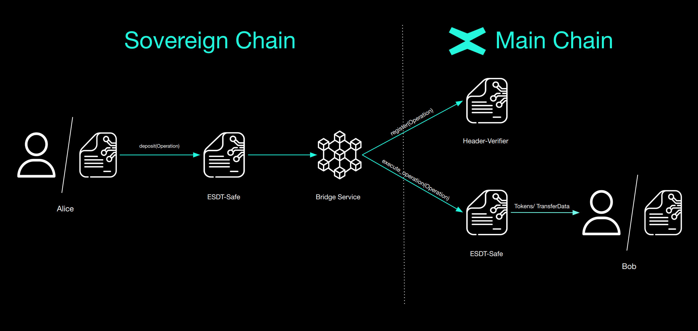

# Sov-ESDT-Safe


Whether an External Owned Account (EOA) like a user wallet or another smart contract the procedure is simple. An address will be able to perform a multi tokens transfer with various types of tokens:
- Fungible Tokens
- (Dynamic) Non-Fungible Tokens
- (Dynamic) Semi-Fungible Tokens
- (Dynamic) Meta ESDT Tokens

When making the deposit, the user specifies:
1. A destination address on the Sovereign Chain
2. `TransferData` if the execution contains a smart contract call, which contains gas, function and arguments

## Sovereign Chain to Main Chain transfer flow
1. User deposits token to the `Sov-ESDT-Safe` smart contract.
2. Outgoing *Operations* are created at the end of the round.
3. Validators sign all the outgoing *Operations*.
4. Leader sends *Operations* to the bridge service.
5. Bridge service sends the *Operations* to the Header-Verifier for registration and verification, and then to `Mvx-ESDT-Safe` for execution.
6. At the end of the execution success/fail, a confirmation event will be added which will be received in sovereign through the observer and then the cross chain transfer will be completed.

### Deposit Endpoint
```rust
    #[payable("*")]
    #[endpoint]
    fn deposit(
        &self,
        to: ManagedAddress,
        optional_transfer_data: OptionalValueTransferDataTuple<Self::Api>,
    )
```
As you can both the `Mvx-ESDT-Safe` and `Sov-ESDT-Safe` smart contracts have the `deposit` endpoint. At a high level, they do the same process, depositing funds or calling other smart contracts. The main differences are when each payments is processed. Since the `Sov-ESDT-Safe` smart contract doesn't have the storage mapper for the native token, the payments won't be verified if they include any payment with the native token. 

One key aspect of cross chain transfers from MultiversX Main Chain to a Sovereign Chain is being able to transfer tokens and also execute a smart contract call within single transaction. The `#[payable("*")]` annotation means that the endpoint can receive any tokens that will transferred. If those tokens are from a Sovereign Chain they will be burned otherwise they will be saved in the Smart Contract`s account. The checks enabled for the transfer of tokens are the following:

- If the token is whitelisted or not blacklisted, in that case the tokens can be transferred.
- If the fee is enabled, the smart contract assures that the fee is paid.
- If there are maximum 10 transfers in the transaction.

If the deposit also includes the `optional_transfer_data` parameter it will also have some extra checks regarding the cross-chain execution of endpoints:

- The gas limit must be under the specified limit.
- The endpoint that has to be executed is not blacklisted.


At the end of the `deposit` endpoint, all the extra tokens will be refunded to the caller and an event will be emitted since the bridging process is complete.


```rust
#[event("deposit")]
fn deposit_event(
    &self,
    #[indexed] dest_address: &ManagedAddress,
    #[indexed] tokens: &MultiValueEncoded<MultiValue3<TokenIdentifier, u64, EsdtTokenData>>,
    event_data: OperationData<Self::Api>,
)
```

This log event will emit the destination address and the tokens which will be transferred to the Sovereign Chain.

:::note
The source code for the endpoint can be found [here](https://github.com/multiversx/mx-sovereign-sc/blob/main/sov-esdt-safe/src/deposit.rs).
:::
