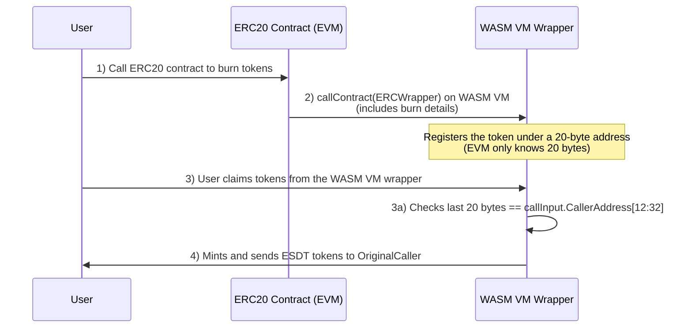

# Standalone EVM

## EVM as example
In the early stages of the MultiversX VM development, there were already components built specifically for EVM compatibility. We are revisiting and reusing parts of that code. In **VM1.2**, for instance, there was a direct correspondence between EVM opcodes and the **BlockchainHook** interface, as well as a mechanism that wrapped MvX-style transaction data (**txData**) into EVM-specific `vmInput`.

## 1. VMExecutionHandlerInterface
The MultiversX protocol defines a **VMExecutionHandlerInterface** with the following functions:

```go
// RunSmartContractCreate computes how a smart contract creation should be performed
RunSmartContractCreate(input *ContractCreateInput) (*VMOutput, error)

// RunSmartContractCall computes the result of a smart contract call and how the system must change after the execution
RunSmartContractCall(input *ContractCallInput) (*VMOutput, error)
```
The **SCProcessor** from `mx-chain-sovereign-go` prepares the input information for these functions. We aim to avoid modifying the **SCProcessor** itself; instead, all necessary abstractions will be implemented at the EVM level.

## 2. Input Preparation: EVMInputCreator

When a contract creation request is made (via *ContractCreateInput), an EVMInputCreator component will:
- Convert the `ContractCreateInput` into an EVMInput.
- Invoke the actual EVM smart contract logic.

The EVM itself is taken from the official Go implementation ([evm.go](https://github.com/ethereum/go-ethereum/blob/master/core/vm/evm.go) in go-ethereum).

## 3. Abstraction Layer: MultiversX & EVM Interfaces

To allow the EVM to function within MultiversX, we introduce a layer that bridges EVM interfaces with MultiversX components. The core interface it uses is the `BlockchainHookInterface`, which grants access to critical blockchain data, state, and transaction information.

### 3.1 Reading & Writing to Storage

- **Reading Storage**: When an EVM opcode attempts to read data from the storage (e.g., `readStorageFromTrie(key)`), it should invoke `blockchainHook.ReadFromStorage(scAddress, key)`. Internally, this call goes through the `storageContext` component, which manages reads from local cache if a key has already been accessed or modified during the current transaction.

- **Writing to Storage**: When writing to storage, the EVM opcode should call `SetStorageToAddress(address, key)` in the `storageContext`.

### 3.2 Finalizing State Changes

After EVM execution finishes, we need to commit the resulting state changes to the blockchain. The EVM will use the `outputContext` component, which (together with the `storageContext`) tracks modified accounts and storages. It also creates the final `vmOutput`, which the `scProcessor` in `mx-chain-sovereign-go` will then validate and apply to the blockchain (the trie) if everything is correct.

## 4. Gas Metering

EVM gas metering is handled internally within the EVM code. The VMExecutionHandler can receive a new gas schedule via:

```go
GasScheduleChange(newGasSchedule map[string]map[string]uint64)
```

This function provides the cost of each opcode as a map. The EVM needs the appropriate wrapper functions to load these costs into its **OPCODES** structure.

## 5. Implementation Steps: Integrating EVM

- Start from the SpaceVM code.
- Replace the current executor (WASMER) with the EVM executor.
- During EVM opcode interpretation, invoke the `storageContext` and `meteringContext` functions to manage state changes and track gas consumption.

Once these steps are complete, the underlying EVM logic should effectively run on MultiversX.

## 6. Address Conversion: 20 Bytes vs. 32 Bytes

EVM addresses are 20-bytes long, whereas MultiversX uses 32-byte addresses. To avoid changing the broader MultiversX system, the EVM will use internal transformers:

- **Internal EVM Calls**: Within the EVM, contracts use the last 20 bytes of the corresponding 32-byte MvX address.
- At runtime, the full 32-byte address is still known, and when a storage `read` or `write` occurs, the EVM prefixes the last 20 bytes with 10 bytes of zeros plus a 2-byte `VMType` (the standard MvX smart contract addressing scheme).

### 6.1 Calling EVM Contracts from EVM

When an EVM-based smart contract calls another EVM contract, it uses the 20-byte address. Internally, the system prefixes these 20 bytes with the deterministic overhead (10 bytes of zeros and 2 bytes for `VMType`) to fetch the appropriate contract code from the accounts trie before running it.

### 6.2 Token Storage in EVM

Token balances (like ERC20) live in the contract's own storage. The contract will use the last 20 bytes of a user’s MvX address when recording ownership or balances. If an opcode like `GetCaller` is executed, it returns only the last 20 bytes from the `ContractCallInput.Sender`.

### 6.3 Calling WasmVM from EVM

MultiversX WasmVM expects 32-byte addresses. If an EVM contract tries to invoke a WasmVM contract using only 20 bytes, the call will fail due to incorrect argument size. Consequently, when the EVM calls a WasmVM contract, it must supply a full 32-byte address.

:::note
In most cases, the EVM contracts will call only other EVM contracts. However, bridging to WasmVM is still feasible, for example, when claiming ESDT tokens through an ERC wrapper contract.
:::

## 7. WASM VM and the `ExecuteOnDestOnOtherVM` Function

The **WASM VM** supports a public function `ExecuteOnDestOnOtherVM` via the **BlockchainHook** interface. If a new VM is fully integrated, it can be added to the `vmContainer` component with a new **baseAddress**. Below is an example table illustrating potential base addresses for different VMs:

| VM Name     | Address Suffix   | Notes                                                                            |
|-------------|----------------------|----------------------------------------------------------------------------------|
| **SpaceVM** | 05                   | Standard base address for the WASM VM                                            |
| **System VM** | 255                | Standard base address (example) for the System VM                                |
| **EVM**     | To Be Decided        | Will be assigned upon integration to ensure address derivation works properly    |

From the `SCAddress`, the protocol looks at bytes **10** and **11** to determine which VM should be called. Once EVM integration is complete, it will receive its own base address and will adjust how the **CreateContract** opcode calculates deployed contract addresses.

### 7.1 Synchronous Execution

When the EVM executes a `DelegateCall` opcode, it will invoke an internal function of the new EVM implementation that checks whether execution should occur in the EVM itself or a different VM. If it needs to run on another VM, it calls `blockchainHook.ExecuteOnDestOnOtherVM`.

- **Returning `VMOutput`**: This function returns a `VMOutput`, which can be merged into the current `outputContext` and `storageContext` via the `PushContext`-type public functions.

In the **WASM VM**, if a smart contract calls `ExecuteOnDest`, the VM decides where the execution should take place. For asynchronous calls, the same logic applies:

- **Intra-Shard**: The system calls `ExecuteOnDestOnOtherVM`.  
- **Cross-Shard**: On the destination shard, the **scProcessor** determines which VM to invoke and continues accordingly.

## 8. ESDT ↔ ERC20 & ESDTNFT ↔ ERC721

Bridging MultiversX ESDT standards with common Ethereum-based token standards (ERC20, ERC721, etc.). This introduces several key differences in token handling, especially around **token transfers** and **approval mechanisms**.

### 8.1 ESDT Transfer Model
On MultiversX, transfers typically use a **`transferAndExecute`** paradigm:
- The sender (token owner) explicitly initiates a transfer of tokens and, in the same operation, calls a smart contract endpoint to process further actions (e.g., swapping, staking, etc.).

### 8.2 ERC20 Transfer Model
In the Ethereum ecosystem, the common workflow is:
1. **Approval**: A user grants a smart contract (SC) permission to spend tokens on their behalf by calling `approve(scAddress, amount)`.  
2. **Transfer**: The SC (now approved) calls `transferFrom(user, destination, amount)` to pull tokens from the user’s balance.

This design allows third-party contracts to move funds from a user’s wallet without a new, explicit approval each time. However, it also opens the door to potential exploits: a malicious dApp can trick users into granting excessive approvals, which might be exploited later to drain funds.

### 8.3 The Wrapper/SafeESDT Contract

Because MultiversX prohibits direct “pull” transfers of ESDTs (a fundamental security decision), bridging to ERC-like workflows requires an **intermediary contract**—often called a **wrapper** or **safeESDT** contract:

1. **Deposit**: A user deposits their ESDT tokens into the wrapper contract.  
2. **Allow**: The user can specify which addresses (e.g., other SCs) are allowed to withdraw a certain amount of these deposited tokens.  
3. **Transfer**: The contract implements an ERC20-like `transferFrom()` functionality. When an external EVM-based SC tries to “pull” tokens, it actually interacts with this safeESDT contract, which checks permissions and only then completes the transfer if authorized.  
4. **Withdrawal**: The user can reclaim any unspent tokens from the wrapper contract when they wish.

In the EVM environment, an operation like `safeESDTContract.transferFrom(user, scAddress, amount)` would mimic the ERC20 approach. Under the hood, the **blockchainHook** would manage a synchronous call to the other VM.

### 8.4 Extending to Other ERC Standards

A similar wrapper approach can be adopted for other token types:

- **ERC721 (NFTs)**: An **ESDTNFT** wrapper can track ownership and minted tokens, providing `approve()` and `transferFrom()` methods that mirror standard ERC721 functionality.
- **ERC1155**: This multi-token standard can likewise be “wrapped”, allowing ESDT-based multi-tokens to be interfaced with EVM-based dApps expecting ERC1155 contracts.

By handling all "pull" transfers inside dedicated wrapper contracts, MultiversX preserves its **secure-by-design** “push” transfer model while still enabling compatibility with dApps that rely on ERC-style approvals. 

### Claiming ESDT Tokens from an ERC20 Balance

This diagram illustrates how a user claims an ESDT token originally held in an ERC20 contract on the EVM side. The process involves burning ERC20 tokens, calling a WASM VM wrapper contract, and finally minting ESDT tokens to the user.


