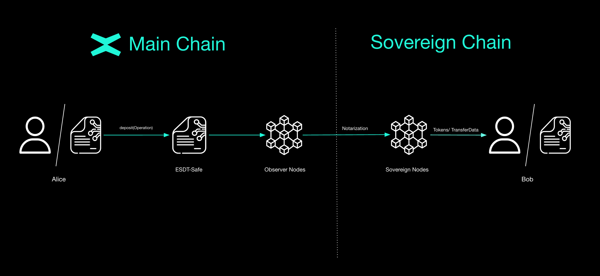

# Execution going to a Sovereign Chain


The ability to transfer tokens from the Main Chain to any Sovereign Chain is essential, since every Sovereign can connect to the Main MultiversX Chain. As a result, the customizable Sovereign can leverage any token available on the default network.

The transfer of tokens is done by the *ESDT-Safe* contract after calling the `deposit` endpoint inside the `to-sovereign` module. 

#### Main Chain deposit to Sovereign Chain depositing flow
1. User deposits the tokens he wishes to transfer in the ESDT-Safe contract deployed on the Main Chain.
2. An observer is monitoring the Main Chain.
3. Sovereign network receives extended shard header.
4. Incoming transactions processor handles and processes the new transaction.

### Depositing
```rust
    #[payable("*")]
    #[endpoint]
    fn deposit(
        &self,
        to: ManagedAddress,
        optional_transfer_data: OptionalValueTransferDataTuple<Self::Api>,
    )
```

One key aspect of cross chain transfers from MultiversX Main Chain to a Sovereign Chain is being able to transfer tokens and also execute a smart contract call within single transaction. This endpoint first checks if the current Sovereign Chain has any enabled fees.

- There can be maximum of 10 transfers per deposit.
- The gas limit must be under the specified limit.
- The endpoint that has to be executed is not blacklisted.

At the end of the `deposit()` endpoint, an event will be emitted and then the bridging process is complete.


```rust
#[event("deposit")]
fn deposit_event(
    &self,
    #[indexed] dest_address: &ManagedAddress,
    #[indexed] tokens: &MultiValueEncoded<MultiValue3<TokenIdentifier, u64, EsdtTokenData>>,
    event_data: OperationData<Self::Api>,
)
```

This log event will emit the destination address and the tokens which will be transferred to the Sovereign Chain.

:::note
Here is the [link](https://github.com/multiversx/mx-sovereign-sc/blob/main/esdt-safe/src/to_sovereign/create_tx.rs) to the `deposit` endpoint.
:::
